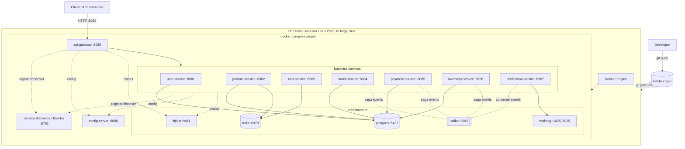

# EC2 + Docker Compose Deployment

Run the entire **krishna.shop** platform — config server, service discovery, gateway, all 7 business services, and every backing datastore — as a single Docker Compose project on one Amazon Linux 2023 EC2 host.

> **This is the current baseline (Phase 4, rung 1).** It is the verified, working deployment: all 8 applications register in Eureka and the full order saga completes (`order → INVENTORY_RESERVED → CONFIRMED`) on a `t3.large`+ instance. Every later strategy in this folder ([`03-asg-blue-green.md`](./03-asg-blue-green.md), [`05-eks.md`](./05-eks.md)) is measured against this rung.

---

## When to use / When NOT to use

**Use this when:**

- You need a complete, running environment fast — demos, integration testing, QA, or a shared dev sandbox.
- You want the whole platform (app + infra) reproducible from one `docker-compose.yml` with no external managed services.
- Cost matters more than availability: one instance, one bill.
- You are validating a change end-to-end before promoting it to a multi-host strategy.

**Do NOT use this when:**

- You need high availability. A single host is a single point of failure — a reboot or hardware fault takes the whole platform down.
- You need to scale services independently under real production load (see the scaling notes below).
- You require zero-downtime deploys, rolling updates, or blue/green cutover — use [`03-asg-blue-green.md`](./03-asg-blue-green.md).
- You are running managed, replicated datastores. Here PostgreSQL, Redis, and Kafka run as single containers with local volumes; there is no replication, failover, or managed backup.
- You have strict data-durability or compliance requirements — container-local volumes are not a durable store.

---

## Architecture flow diagram



---

## Prerequisites

Full instance provisioning is documented in the runbook — see [`../EC2-SETUP.md`](../EC2-SETUP.md). This section is the short checklist; do not duplicate the runbook.

- **AWS EC2 instance:** Amazon Linux 2023 (x86_64), **`t3.large` minimum** (8 GB RAM). `t3.xlarge` (16 GB) recommended — the host both runs ~15 containers and compiles the Java services, so smaller instances OOM.
- **Root volume:** **30 GB gp3** (the 8 GB default is too small for the multi-stage build layers and image cache).
- **Security group (inbound), restricted to your IP:**

  | Port | Purpose |
  |------|---------|
  | 22   | SSH |
  | 8080 | API Gateway (main entry point) |
  | 8761 | Eureka dashboard |
  | 8025 | MailHog UI |
  | 9411 | Zipkin UI |
  | 8888 | Config Server (optional) |

  Ports **8081–8087 do not need to be open** — client traffic flows through the gateway on 8080.
- **Software on the host:** Docker Engine, **Docker Compose v2** (the `docker compose` plugin, not the legacy `docker-compose` binary), **buildx** (bundled with current Docker, required by the multi-stage build), and **git**.

Verify tooling once connected:

```bash
docker version && docker compose version && docker buildx version && git --version
```

---

## Deployment steps

1. **SSH into the instance** (see [`../EC2-SETUP.md`](../EC2-SETUP.md) for key setup):

   ```bash
   ssh -i /path/to/your-key.pem ec2-user@<EC2_IP>
   ```

2. **Clone the repository** (first deploy) — or pull the latest on an existing host:

   ```bash
   # first time
   git clone <REPO_URL> ~/filpkart
   cd ~/filpkart

   # subsequent deploys
   cd ~/filpkart
   git pull --ff-only
   ```

3. **Build all images and start the full stack** (detached). The single parameterized `Dockerfile` at the repo root builds each module via `mvn -pl ${MODULE} -am package`; Compose builds every service image and starts infra + apps with healthchecks and `depends_on` ordering:

   ```bash
   docker compose up -d --build
   ```

   The first build is slow (Maven downloads plus a fat jar per service). Core services (`config-server`, `service-discovery`) come up first; business services wait on their `depends_on` healthchecks, then register in Eureka.

4. **Verify container state** — all services should be `running` (and `healthy` where a healthcheck is defined):

   ```bash
   docker compose ps
   ```

   Tail the core services if anything is slow to settle:

   ```bash
   docker compose logs -f config-server service-discovery
   ```

5. **Confirm registration in Eureka** — open the dashboard and check that all 8 applications (gateway + 7 business services) are listed as `UP`:

   ```
   http://<EC2_IP>:8761
   ```

---

## Configuration

Configuration is centralized and injected at container start; nothing is baked into images.

- **Config Server (`native` profile):** `config-server` runs on port **8888** with the `native` profile and mounts the repo's config directory read-only:

  ```yaml
  config-server:
    environment:
      SPRING_PROFILES_ACTIVE: "native"
      SPRING_CLOUD_CONFIG_SERVER_NATIVE_SEARCHLOCATIONS: "file:/config-repo"
    volumes:
      - ./config-repo:/config-repo:ro
  ```

  Edit files under `./config-repo/` on the host to change per-service configuration; they are served directly from the mount (no external git backend needed).

- **`spring.config.import`:** each application imports its configuration from the config server at boot. In Compose this is driven by the `CONFIG_IMPORT` env var pointing at the in-network config-server hostname:

  ```
  CONFIG_IMPORT=configserver:http://config-server:8888
  ```

- **The `x-cluster-env` anchor:** cluster-wide overrides are defined once as a YAML anchor and merged into every app service with `<<: *cluster-env`, so all services share consistent discovery, config, Kafka, and tracing endpoints:

  ```yaml
  x-cluster-env: &cluster-env
    CONFIG_IMPORT: "configserver:http://config-server:8888"
    EUREKA_CLIENT_SERVICEURL_DEFAULTZONE: "http://service-discovery:8761/eureka/"
    SPRING_KAFKA_BOOTSTRAP_SERVERS: "kafka:9092"
    MANAGEMENT_ZIPKIN_TRACING_ENDPOINT: "http://zipkin:9411/api/v2/spans"
  ```

  Individual services then add their own env on top — e.g. `SPRING_DATASOURCE_URL` for their PostgreSQL database (`user_db`, `product_db`, `order_db`, `payment_db`, `inventory_db`), `SPRING_DATA_REDIS_HOST: redis` for cart/product/gateway, or `SPRING_MAIL_HOST: mailhog` for notifications.

- **Eureka:** all apps register with and discover each other through `service-discovery:8761`; the gateway resolves routes via Eureka rather than hardcoded hosts.

- **Kafka:** the single-node KRaft broker is reachable in-network at `kafka:9092`. The order saga (`order-service`, `payment-service`, `inventory-service`, `notification-service`) publishes and consumes over it. Internal topics use replication factor 1 (single node), which is set in the `kafka` service environment.

To change a cluster-wide endpoint, edit the `x-cluster-env` anchor once; to change one service, edit that service's own `environment` block or its file under `config-repo/`.

---

## Verification

1. **Run the smoke test** — it exercises the whole path: register → login → add to cart → place order → poll until the order reaches `CONFIRMED`:

   ```bash
   bash scripts/smoke-test.sh
   ```

   Expected outcome: the order saga completes and the script reports success, with the order transitioning `order → INVENTORY_RESERVED → CONFIRMED`.

2. **Check the confirmation email in MailHog** — the notification-service sends the order confirmation via SMTP to MailHog:

   ```
   http://<EC2_IP>:8025
   ```

3. **Inspect the trace in Zipkin** — confirm the request fanned out across gateway and services (Micrometer Tracing → Zipkin):

   ```
   http://<EC2_IP>:9411
   ```

Per-service health and metrics are also available via Actuator (`/actuator/health`, `/actuator/prometheus`) on each service.

---

## Rollback

Because the whole platform is one Compose project pinned to a git commit, rollback is "check out the previous commit and rebuild."

- **Roll back the whole stack** to a known-good commit:

  ```bash
  cd ~/filpkart
  git fetch --all
  git checkout <prev-sha>
  docker compose up -d --build
  ```

- **Roll back / restart a single service** without touching the rest — rebuild just that service after checking out the older source (or pinning its image), then recreate only it:

  ```bash
  docker compose up -d --build order-service
  # or, to bounce it without rebuilding:
  docker compose restart order-service
  ```

- **Diagnose during rollback** — follow one service's logs:

  ```bash
  docker compose logs -f order-service
  ```

- **Data note:** `docker compose down` stops containers but keeps volumes. Avoid `docker compose down -v` during a rollback — it wipes the PostgreSQL and Kafka volumes. Rolling application code back does **not** roll back Flyway migrations already applied to the databases; verify schema compatibility before reverting across a migration boundary.

---

## Scaling & HA notes

Be honest about the ceiling of this strategy:

- **Single host = single point of failure.** There is no redundancy. An instance reboot, an AZ event, or the host running out of memory takes the entire platform down. There is no automatic recovery.
- **Vertical scaling only.** You grow by moving to a larger instance type (`t3.large` → `t3.xlarge` → …). You cannot spread load across machines.
- **`docker compose up -d --scale <svc>=N` is limited.** You can run multiple replicas of a stateless business service on the same host, but:
  - It still shares one host's CPU, memory, and network — you are not adding fault tolerance, only concurrency on the same box.
  - Services with a fixed host port mapping (e.g. the gateway on `8080`) cannot be scaled naively because the host port would collide; you would need to drop the static port mapping and front them with a load balancer.
  - The single-node PostgreSQL, Redis, and Kafka containers remain shared, unreplicated bottlenecks regardless of app replica count.
- **This is exactly why the later strategies exist.** For horizontal scaling, self-healing, and zero-downtime deploys, graduate to the Auto Scaling Group + blue/green approach in [`03-asg-blue-green.md`](./03-asg-blue-green.md), or full container orchestration with [`05-eks.md`](./05-eks.md).

---

## Pros / Cons

| Pros | Cons |
|------|------|
| Fastest path to a complete running platform | Single host — one point of failure, no HA |
| One `docker-compose.yml` describes app + all infra | No independent horizontal scaling; vertical only |
| Cheapest option — a single instance | Datastores are single, unreplicated containers |
| Fully reproducible; trivial teardown/rebuild | No zero-downtime / rolling deploys (rebuild = brief downtime) |
| No external managed services or cloud wiring to configure | Build + run on the same box needs a large instance (RAM/disk) |
| Rollback is a `git checkout` + rebuild | Local volumes are not a durable/backed-up datastore |
| Ideal for demo, QA, integration testing, dev sandbox | Not suitable for production traffic or compliance-sensitive data |

---

## Cost

Rough order-of-magnitude, single region, on-demand:

- **1 × `t3.large` on-demand ≈ $60/month** (compute only, running 24/7; roughly $0.083/hr in `us-east-1`).
- **`t3.xlarge` (recommended) ≈ $120/month** on-demand.
- **Storage:** 30 GB gp3 ≈ $2–3/month.
- **Data transfer:** minimal for dev/test; scales with outbound traffic.

Costs drop sharply if the instance is stopped when idle (you pay only for the EBS volume while stopped), or with a 1-year Savings Plan / Reserved Instance for a persistent environment. All figures are approximate — check current AWS pricing for your region.
