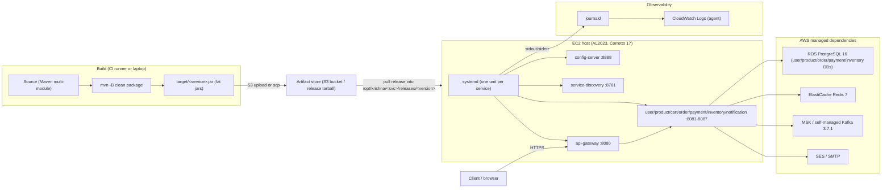
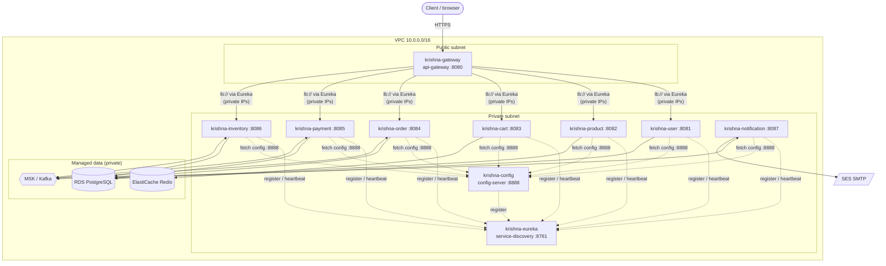

# EC2 + systemd Deployment (fat jars, no containers)

> **Phase 4a** — Run the krishna.shop Spring Boot fat jars directly on an Amazon EC2 host, supervised one-process-per-service by `systemd`, with PostgreSQL, Redis, and Kafka provided by AWS managed services. No Docker, no Kubernetes, no container runtime of any kind.

---

## When to use / When NOT to use

### Use this strategy when

- Your organization has standardized on plain virtual machines and has **no container runtime** (Docker/containerd) available or approved.
- You want the **simplest possible JVM operations model**: a jar, an `EnvironmentFile`, and a systemd unit — nothing else to learn.
- You are running a **single host** (or a small, fixed number of hosts) for dev, staging, demo, or a low-traffic production environment.
- You want boot-time supervision, automatic restart on crash, and centralized logging (journald) without introducing an orchestrator.
- You are comfortable managing OS packages, users, and file permissions on the box yourself.

### Do NOT use this strategy when

- You need **high availability** — a single EC2 host is a single point of failure. systemd only supervises processes on *one* machine; it cannot fail over to another host.
- You need **horizontal autoscaling** driven by load. systemd has no concept of scaling out.
- You need **zero-downtime rolling or blue/green deploys** across a fleet. See [`03-asg-blue-green.md`](./03-asg-blue-green.md) for Auto Scaling Group + ALB blue/green.
- You want immutable, reproducible artifacts and environment parity across dev/prod — prefer the container track ([`01-*`](./) and beyond).
- You are running many services at high density and need bin-packing / resource isolation — that is what Kubernetes gives you.

---

## Architecture flow diagram



**Flow summary:** fat jars are built in CI (or on a laptop), published to an S3 bucket (or copied by `scp`), pulled onto the EC2 host into a versioned release directory, and supervised by systemd as one JVM process per service. Traffic enters through `api-gateway:8080`. State lives in AWS managed services (RDS, ElastiCache, MSK/Kafka, SES). Logs flow from stdout/stderr into journald and optionally on to CloudWatch Logs.

---

## Prerequisites

### Host

- **Amazon EC2** instance running **Amazon Linux 2023 (AL2023)**. A `t3.large` (2 vCPU / 8 GiB) is a reasonable starting point for all ten services on one box; size up if the JVMs contend for memory.
- Java 17 (Amazon Corretto):

  ```bash
  sudo dnf install -y java-17-amazon-corretto-headless
  java -version   # expect: openjdk version "17.x"
  ```

- A dedicated, non-login **system user** to own and run the services:

  ```bash
  sudo useradd --system --create-home --home-dir /opt/krishna --shell /usr/sbin/nologin krishna
  ```

- Base directory layout under `/opt/krishna/<service>/`, with a `current` symlink pointing at a versioned release directory (see next section).

### Managed dependencies (endpoints you must have on hand)

| Dependency | AWS service | Needed by | Example endpoint |
|---|---|---|---|
| PostgreSQL 16 | **RDS** (databases `user_db`, `product_db`, `order_db`, `payment_db`, `inventory_db`; Flyway migrates on startup) | user, product, order, payment, inventory | `krishna-db.abc123.us-east-1.rds.amazonaws.com:5432` |
| Redis 7 | **ElastiCache** | cart-service | `krishna-redis.abc123.use1.cache.amazonaws.com:6379` |
| Kafka 3.7.1 | **MSK** (or self-managed) | order saga (order-service et al.) | `b-1.krishna.kafka.us-east-1.amazonaws.com:9092,...` |
| SMTP | **SES** (or any SMTP relay) | notification-service | `email-smtp.us-east-1.amazonaws.com:587` |

### Network / security

- The EC2 **security group** must allow inbound `8080` from clients (or from an upstream ALB) and permit egress to the RDS/ElastiCache/MSK/SES endpoints on their respective ports.
- The RDS, ElastiCache, and MSK security groups must allow inbound from the EC2 instance's security group.
- If exporting logs, attach an **IAM instance profile** granting the CloudWatch Logs agent permission (and S3 read if pulling artifacts from S3).

---

## Directory & release layout

Each service gets its own tree. Releases are immutable, versioned directories; `current` is a symlink you atomically repoint on deploy and rollback. Runtime configuration lives outside the release tree in `/etc/krishna/<service>.env` and is referenced by the unit's `EnvironmentFile`.

```text
/opt/krishna/
├── config-server/
│   ├── releases/
│   │   ├── 1.0.0-20260830-1/
│   │   │   └── app.jar
│   │   └── 1.0.0-20260831-1/
│   │       └── app.jar
│   └── current -> releases/1.0.0-20260831-1
├── order-service/
│   ├── releases/
│   │   └── 1.0.0-20260831-1/
│   │       └── app.jar
│   └── current -> releases/1.0.0-20260831-1
├── ...                       # one tree per service
└── config-repo/              # config-server native profile reads this on disk

/etc/krishna/
├── config-server.env
├── service-discovery.env
├── api-gateway.env
├── user-service.env
├── order-service.env
└── ...                       # one EnvironmentFile per service
```

Notes:

- The **config-server** requires the `config-repo/` directory to be present on disk (it runs the Spring Cloud Config **native** profile). Ship `config-repo/` to the host (e.g. `/opt/krishna/config-repo`) and point the config-server's `spring.cloud.config.server.native.search-locations` at it via its EnvironmentFile.
- `common-lib` is a library dependency baked into the fat jars — it is **not** deployed as a service.
- Keeping the jar named `app.jar` inside each versioned directory means the systemd `ExecStart` path never changes; only the `current` symlink moves.

---

## systemd unit template

A full example for `order-service`. Save as `/etc/systemd/system/krishna-order-service.service`:

```ini
[Unit]
Description=krishna.shop order-service (Spring Boot)
Documentation=https://github.com/your-org/flipkart
# Bring up networking before the JVM starts.
After=network-online.target
Wants=network-online.target
# NOTE ON ORDERING: config-server (8888) and service-discovery/Eureka (8761)
# must be healthy before any business service. systemd After= only orders unit
# *start*, not readiness, and it cannot order across separate hosts. On a single
# host you may add the lines below so a reboot brings services up in dependency
# order; the services also retry config/Eureka lookups on their own, so strict
# gating is optional.
After=krishna-config-server.service krishna-service-discovery.service
Wants=krishna-config-server.service krishna-service-discovery.service

[Service]
Type=simple
User=krishna
Group=krishna
WorkingDirectory=/opt/krishna/order-service/current
EnvironmentFile=/etc/krishna/order-service.env
ExecStart=/usr/bin/java -XX:MaxRAMPercentage=75 -jar /opt/krishna/order-service/current/app.jar
# Restart the JVM if it exits non-zero; give it time to release ports.
Restart=on-failure
RestartSec=10
# 143 = 128 + SIGTERM(15); treat a clean shutdown-by-signal as success.
SuccessExitStatus=143
TimeoutStopSec=60

[Install]
WantedBy=multi-user.target
```

### Templating it per service

Every service uses the identical unit except for three substitutions: the service **name**, its **port** (informational — the port is actually set via the EnvironmentFile / config), and its **dependency set**. Produce one unit file per service by substituting the name:

```bash
for svc in config-server service-discovery api-gateway \
           user-service product-service cart-service order-service \
           payment-service inventory-service notification-service; do
  sed "s/order-service/${svc}/g" krishna-order-service.service \
    | sudo tee /etc/systemd/system/krishna-${svc}.service >/dev/null
done
```

Then hand-adjust two special cases:

- **config-server** and **service-discovery**: remove the `After=/Wants=krishna-config-server ... krishna-service-discovery` lines (they must not depend on themselves or on each other in that direction — config-server has no dependencies; Eureka depends only on config-server).
- Give each service its correct `Description` and confirm its `EnvironmentFile` exists.

> Prefer not to duplicate ten near-identical files? systemd **template units** (`krishna@.service` with `%i`) also work; the flat-file approach above is shown for clarity and easy per-service tuning.

---

## Deployment steps

Assumes jars are already built. `VERSION` is any monotonic release tag, e.g. `1.0.0-20260831-1`.

```bash
# 1. Build all fat jars at the repo root (CI runner or laptop).
mvn -B clean package
#    Produces target/<service>.jar for every deployable module.

# 2. Publish artifacts (choose ONE transport).
#    (a) via S3:
aws s3 cp target/order-service.jar \
  s3://krishna-artifacts/1.0.0-20260831-1/order-service.jar
#    (b) or directly via scp to the host:
scp target/order-service.jar ec2-user@HOST:/tmp/order-service.jar

# ---- the remaining steps run ON the EC2 host ----

VERSION=1.0.0-20260831-1
SVC=order-service

# 3. Create the versioned release dir and drop the jar in as app.jar.
sudo -u krishna mkdir -p /opt/krishna/${SVC}/releases/${VERSION}
#    from S3:
sudo -u krishna aws s3 cp \
  s3://krishna-artifacts/${VERSION}/${SVC}.jar \
  /opt/krishna/${SVC}/releases/${VERSION}/app.jar
#    or from the scp'd file:
sudo install -o krishna -g krishna -m 0644 \
  /tmp/${SVC}.jar /opt/krishna/${SVC}/releases/${VERSION}/app.jar

# 4. Atomically repoint the 'current' symlink to the new release.
sudo -u krishna ln -sfn /opt/krishna/${SVC}/releases/${VERSION} \
  /opt/krishna/${SVC}/current

# 5. Reload systemd so it picks up any unit changes.
sudo systemctl daemon-reload

# 6. Enable + start in dependency order.
#    First boot / full bring-up ordering:
sudo systemctl enable --now krishna-config-server
sudo systemctl enable --now krishna-service-discovery
sudo systemctl enable --now krishna-api-gateway
for s in user-service product-service cart-service order-service \
         payment-service inventory-service notification-service; do
  sudo systemctl enable --now krishna-${s}
done

#    For a subsequent redeploy of ONE service, just restart it:
sudo systemctl restart krishna-${SVC}
```

> **Startup order matters:** always **config-server → service-discovery (Eureka) → api-gateway → business services**. Business services fetch their config from config-server (`spring.config.import=configserver:...`) and register with Eureka on startup; if those two are not up, the services will log retries until they are.

### Example EnvironmentFile

`/etc/krishna/order-service.env` — plain `KEY=VALUE`, no `export`, no shell quoting expansion:

```bash
# Where to fetch config from (config-server on this host).
CONFIG_IMPORT=configserver:http://localhost:8888
# Eureka registry.
EUREKA_CLIENT_SERVICEURL_DEFAULTZONE=http://localhost:8761/eureka/
# Kafka (order saga) — MSK bootstrap brokers.
SPRING_KAFKA_BOOTSTRAP_SERVERS=b-1.krishna.kafka.us-east-1.amazonaws.com:9092,b-2.krishna.kafka.us-east-1.amazonaws.com:9092
# RDS PostgreSQL (order_db). Flyway migrates on startup.
SPRING_DATASOURCE_URL=jdbc:postgresql://krishna-db.abc123.us-east-1.rds.amazonaws.com:5432/order_db
SPRING_DATASOURCE_USERNAME=order_user
SPRING_DATASOURCE_PASSWORD=change-me-use-secrets-manager
# Optional: activate a profile, tune the port, etc.
SERVER_PORT=8084
```

Per-service notes:

- **cart-service** additionally needs `SPRING_DATA_REDIS_HOST` (and typically `SPRING_DATA_REDIS_PORT=6379`) pointing at the ElastiCache endpoint.
- **notification-service** needs SMTP settings for SES (`SPRING_MAIL_HOST`, `SPRING_MAIL_PORT`, credentials).
- **config-server** points `spring.cloud.config.server.native.search-locations` at the on-disk `config-repo/` and does *not* set `CONFIG_IMPORT`.
- Store real secrets in **AWS Secrets Manager / SSM Parameter Store** and render them into these files at deploy time; keep the files `chmod 0640 root:krishna`.

---

## Verification

```bash
# Is the unit active and, if using health checks, healthy?
systemctl status krishna-order-service

# Follow the JVM's logs live (journald captures stdout/stderr).
journalctl -u krishna-order-service -f

# Confirm all krishna units at a glance.
systemctl list-units 'krishna-*' --all
```

- Open the **Eureka dashboard** at `http://<host>:8761` and confirm every business service (and the gateway) has registered.
- Confirm the gateway is serving: `curl -i http://<host>:8080/actuator/health` (should return `200`).
- Run the end-to-end smoke test from the repo root:

  ```bash
  bash scripts/smoke-test.sh
  ```

If a service is stuck restarting, `journalctl -u krishna-<svc> -n 200 --no-pager` usually shows the cause (missing config-server, bad datasource URL, failed Flyway migration, etc.).

---

## Rollback

Because `current` is just a symlink, rollback is instantaneous: repoint it at the previous release directory and restart the unit.

```bash
SVC=order-service
PREV=1.0.0-20260830-1

# 1. Point 'current' back at the previous release.
sudo -u krishna ln -sfn /opt/krishna/${SVC}/releases/${PREV} \
  /opt/krishna/${SVC}/current

# 2. Restart the service on the old jar.
sudo systemctl restart krishna-${SVC}

# 3. Confirm.
systemctl status krishna-${SVC}
journalctl -u krishna-${SVC} -f
```

**Retention** — keep the last **N** releases (e.g. 5) so rollback targets remain on disk, and prune older ones:

```bash
SVC=order-service
cd /opt/krishna/${SVC}/releases
ls -1dt */ | tail -n +6 | xargs -r sudo rm -rf   # keep newest 5
```

> **Caveat — database migrations.** Rolling the jar back does *not* roll back Flyway migrations already applied to RDS. If a release added a schema change, ensure the older jar is still compatible with the migrated schema (favor additive, backward-compatible migrations), or plan a forward fix instead of a code-only rollback.

---

## Topology variant: one service per EC2 instance (distributed)

Everything above assumes **all ten JVMs on one host**. This variant instead gives **each service its own EC2 instance**. It is the best way to *learn* real microservice mechanics — cross-host service discovery, VPC networking, and independent service lifecycles become physical and visible instead of hidden behind `localhost`.

> **Reality check.** One-service-per-VM is a superb *teaching* topology, but it is **not** how modern production actually achieves isolation. In production you get the same isolation far more cheaply with **one service per container/pod, many pods packed onto shared nodes** — that is exactly what [`05-eks.md`](./05-eks.md) does. Think of this variant as the conceptual stepping-stone to Kubernetes: it makes the distribution explicit before EKS makes it dense and automated. Running ten idle `t3.micro`/`t3.small` boxes is wasteful for anything beyond learning.

### Instance inventory

Ten instances, one deployable service each (`common-lib` is a library, not deployed). All in the **same VPC** so they can reach each other by **private IP**.

| Instance | Service | Port | Public? | Suggested size |
|---|---|---|---|---|
| `krishna-config` | config-server | 8888 | No | t3.micro |
| `krishna-eureka` | service-discovery | 8761 | No | t3.micro |
| `krishna-gateway` | api-gateway | 8080 | **Yes** (or behind ALB) | t3.small |
| `krishna-user` | user-service | 8081 | No | t3.micro |
| `krishna-product` | product-service | 8082 | No | t3.micro |
| `krishna-cart` | cart-service | 8083 | No | t3.micro |
| `krishna-order` | order-service | 8084 | No | t3.micro |
| `krishna-payment` | payment-service | 8085 | No | t3.micro |
| `krishna-inventory` | inventory-service | 8086 | No | t3.micro |
| `krishna-notification` | notification-service | 8087 | No | t3.micro |

Only the **gateway** is reachable from the internet (directly, or — better — via an ALB). Every other service is private and reached only from inside the VPC.

### Network diagram



### The security-group matrix (the part people get wrong)

Because services now live on separate hosts, the ports that were `localhost` before must be **explicitly opened between instances**. The clean pattern: one security group per tier, each allowing inbound only from the SGs that actually call it.

| Security group | Inbound rule | Source | Why |
|---|---|---|---|
| `sg-gateway` | TCP 8080 | Internet (or ALB SG) | Public entrypoint |
| `sg-config` | TCP 8888 | `sg-gateway` + all service SGs | Everyone fetches config |
| `sg-eureka` | TCP 8761 | `sg-gateway` + all service SGs | Everyone registers/queries |
| `sg-service` (8081–8087) | TCP 8081–8087 | `sg-gateway` (and peers that call each other) | Gateway routes to services; order-service calls cart-service |
| `sg-rds` | TCP 5432 | user/product/order/payment/inventory SGs | DB access |
| `sg-redis` | TCP 6379 | `sg-cart` | Cart only |
| `sg-msk` | TCP 9092 | order/payment/inventory/notification SGs | Saga events |

> Rule of thumb: if service A no longer works after the split, it's almost always a **missing security-group rule** — the JVM is fine, the packet is being dropped.

### The config changes that make it work

On a single host everything pointed at `localhost`. Across hosts you must (a) point each service at the config-server and Eureka **private IPs/DNS**, and (b) make each service **register with Eureka by its own private IP**, not its hostname (otherwise the gateway can't route to it).

`/etc/krishna/order-service.env` on the `krishna-order` instance:

```bash
# Config-server is now on a DIFFERENT host — use its private IP or private DNS.
CONFIG_IMPORT=configserver:http://10.0.12.10:8888
# Eureka is on its own host too.
EUREKA_CLIENT_SERVICEURL_DEFAULTZONE=http://10.0.12.11:8761/eureka/

# CRITICAL: advertise this instance to Eureka by IP, not by hostname.
# Without this the gateway resolves lb://order-service to an unreachable
# internal EC2 hostname and every routed call fails.
EUREKA_INSTANCE_PREFER_IP_ADDRESS=true

# Shared managed data (same endpoints on every service host).
SPRING_KAFKA_BOOTSTRAP_SERVERS=b-1.krishna.kafka.us-east-1.amazonaws.com:9092
SPRING_DATASOURCE_URL=jdbc:postgresql://krishna-db.abc123.us-east-1.rds.amazonaws.com:5432/order_db
SPRING_DATASOURCE_USERNAME=order_user
SPRING_DATASOURCE_PASSWORD=change-me-use-secrets-manager
SERVER_PORT=8084
```

Apply the same two changes (`CONFIG_IMPORT`, `EUREKA_CLIENT_SERVICEURL_DEFAULTZONE` → private IPs, plus `EUREKA_INSTANCE_PREFER_IP_ADDRESS=true`) to **every** service's EnvironmentFile. The gateway needs `EUREKA_CLIENT_SERVICEURL_DEFAULTZONE` too, since it discovers routes through Eureka.

> **Private IPs change** when an instance is stopped/started. For stable addressing, either use each instance's **private DNS name**, attach **secondary ENIs**, or (cleanest) put config-server and Eureka behind small **internal ALBs / Route 53 private records** and point everyone at those stable names.

### Per-instance deployment

Each box now installs **only its own** service — not all ten. On the `krishna-order` instance:

```bash
SVC=order-service
VERSION=1.0.0-20260831-1

# Only this service's tree, unit, and env file exist on this host.
sudo -u krishna mkdir -p /opt/krishna/${SVC}/releases/${VERSION}
sudo -u krishna aws s3 cp s3://krishna-artifacts/${VERSION}/${SVC}.jar \
  /opt/krishna/${SVC}/releases/${VERSION}/app.jar
sudo -u krishna ln -sfn /opt/krishna/${SVC}/releases/${VERSION} /opt/krishna/${SVC}/current
sudo systemctl daemon-reload
sudo systemctl enable --now krishna-${SVC}
```

**Cross-host startup ordering:** the single-host `After=krishna-config-server ...` unit directives **do not work across hosts** — systemd only orders units on the same machine. Instead, bring the *instances* up in order (config → eureka → gateway → business) and rely on each service's built-in **config/Eureka retry** (the `spring.cloud.config.retry` block you already have) to tolerate a not-yet-ready dependency. Remove the cross-service `After=/Wants=` lines from the units in this topology.

### Verifying the distributed setup

- From the `krishna-order` box, confirm it can *reach* its dependencies before blaming the app:
  ```bash
  curl -s http://10.0.12.10:8888/actuator/health   # config-server reachable?
  curl -s http://10.0.12.11:8761/eureka/apps        # Eureka reachable?
  ```
  A hang/timeout here = a **security-group** problem, not an app problem.
- Open Eureka (`http://<eureka-ip>:8761`) and confirm each service registered with its **private IP** as the instance address.
- Run `bash scripts/smoke-test.sh` with `GATEWAY` pointed at the gateway instance's public address. A `503`/route failure on a downstream call almost always means `PREFER_IP_ADDRESS` is unset or a service SG blocks the gateway.

### Cost of this variant

Ten `t3.micro` instances (~$7.50/mo each on-demand, us-east-1 ballpark) ≈ **~$75/month just for compute**, plus the shared RDS/ElastiCache/MSK. That is *more* than the single `t3.large` baseline for *less* total capacity — the price you pay for physical isolation. For learning it's worth it; for anything real, this is precisely the inefficiency that containers-on-shared-nodes (EKS) eliminate.

---

## Scaling & HA

systemd supervises processes on **exactly one host** — it does not fail over, load-balance, or autoscale. To grow beyond a single box:

- Put **multiple EC2 hosts behind an Application Load Balancer (ALB)**, with the ALB target group pointing at `api-gateway:8080` on each host. This gives you redundancy and horizontal capacity for the gateway/business tier.
- Point every host at the **same** RDS, ElastiCache, and MSK endpoints so state stays shared. Eureka can run as a small cluster, or you can run one discovery node per host.
- Once you want **autoscaling and zero-downtime blue/green** across that fleet, graduate to the Auto Scaling Group approach in [`03-asg-blue-green.md`](./03-asg-blue-green.md), which builds directly on the release-directory / EnvironmentFile conventions established here.

This strategy is best understood as the **single-host baseline** that the ASG document scales out.

---

## Pros / Cons

| Pros | Cons |
|---|---|
| Simplest possible ops model — a jar, an env file, a unit | Single host = single point of failure; no built-in HA |
| No container runtime, registry, or orchestrator to install or learn | No autoscaling; capacity is fixed to the instance size |
| Native OS supervision: boot ordering, auto-restart, `journalctl` | Manual OS patching, JDK upgrades, and dependency drift |
| Instant, atomic rollback via `current` symlink | Multi-service redeploys are scripted, not orchestrated |
| Low overhead — JVMs run directly, no container tax | Less environment parity vs. immutable container images |
| Cheap to run for small/low-traffic environments | Startup ordering (config → Eureka → rest) must be managed by hand |

---

## Cost

Rough order-of-magnitude for a small always-on environment (us-east-1, on-demand, mid-2026 list-price ballpark — confirm with the AWS pricing calculator):

- **EC2** `t3.large` (all ten JVMs on one host): ~$60/month on-demand; roughly half that on a 1-year Savings Plan.
- **RDS PostgreSQL** `db.t3.medium` single-AZ: ~$50–70/month plus storage.
- **ElastiCache Redis** `cache.t3.micro`: ~$12–15/month.
- **MSK** is the big lever — the smallest broker sizing runs well into the hundreds/month; **self-managing Kafka on the same or an adjacent EC2 instance** is far cheaper for non-production.
- **SES** is inexpensive (fractions of a cent per email); data transfer and CloudWatch Logs are typically minor.

Net: a lean single-host non-prod setup can land in the **low-to-mid hundreds of dollars per month**, dominated by RDS and (if used) MSK. Choosing self-managed Kafka and Savings Plans for EC2/RDS is the main way to cut the bill.
