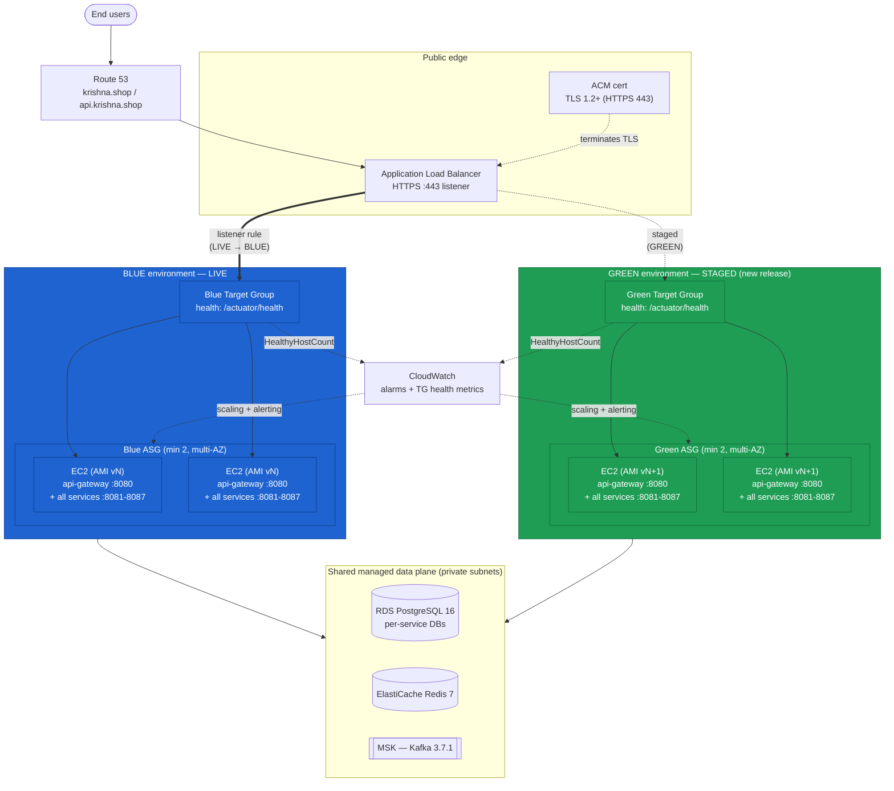

# Auto Scaling Group (ASG) — Blue/Green Deployment

> Zero-downtime, instant-rollback releases for **krishna.shop** by running two identical AWS fleets behind one ALB and flipping the listener from the live (blue) fleet to the new (green) fleet in a single API call.

**Phase 4b — the platform's next deployment milestone.** This builds directly on the container image and stack defined in [`01-ec2-docker-compose.md`](./01-ec2-docker-compose.md) and the fat-jar/systemd variant in [`02-ec2-systemd.md`](./02-ec2-systemd.md), and is provisioned by the project's Terraform IaC phase.

---

## Concept

**Blue/green** deployment keeps **two identical production environments** side by side:

- **Blue** = the currently live environment serving 100% of user traffic.
- **Green** = the new release, deployed and fully health-checked *before* it ever sees a user.

Both fleets sit behind a single **Application Load Balancer (ALB)**. Each fleet is an independent **Auto Scaling Group (ASG)** wired to its own **Target Group (TG)**. You promote green by pointing the ALB's HTTPS listener at the **green TG** — one atomic action. If anything is wrong, you point the listener **back at the blue TG** and you are recovered in seconds, because blue is still running, warm, and unmodified.

The key property: **the release and the traffic cutover are separate events.** You deploy green calmly, watch it pass health checks and smoke tests, and only then take the fast, reversible step of switching traffic.

**Contrast with other strategies:**

- **Rolling update** — replaces instances in a single ASG a few at a time; cheaper (no double fleet) but you run mixed versions during the roll and rollback means rolling *again*, which is slow. *(Covered conceptually here; not the chosen strategy for this phase.)*
- **Canary** — sends a small weighted slice of traffic (e.g. 5%) to the new version first, then ramps up; excellent for risk control but needs weighted routing and good metrics discipline. *(Covered conceptually; ALB weighted target groups make this a natural later evolution of the blue/green setup below.)*

Blue/green is the sweet spot for krishna.shop right now: full pre-cutover validation, instant rollback, and a mechanism (weighted TGs) that later upgrades cleanly into canary.

---

## When to use / When NOT to use

**Use blue/green when:**

- You need **zero-downtime** releases of the public api-gateway and its backing services.
- You want **instant, low-risk rollback** (a listener flip, not a redeploy).
- Releases are **backward-compatible at the data layer** — both versions can talk to the same RDS schema, Redis, and Kafka topics during the overlap window.
- You can afford to run **~2× the fleet briefly** during cutover.
- Services are **stateless** (they are here — session/cart state lives in Redis, data in RDS, events in Kafka/MSK).

**Do NOT use blue/green (or use with extra care) when:**

- A release includes a **breaking, non-backward-compatible DB migration** — blue and green share one RDS, so an incompatible schema change breaks the live fleet. Use expand/contract (additive) migrations, or coordinate the schema change as its own phase.
- The workload is **stateful on-instance** (local disk, in-JVM caches that must survive) — krishna.shop avoids this by design.
- Budget forbids any period of doubled infrastructure and downtime is acceptable — a rolling update may be cheaper.
- The change is a tiny config tweak better served by a parameter/flag flip than a full fleet swap.

---

## Architecture flow diagram



Solid line = live traffic (ALB → blue TG). Dashed line to green = registered and health-checked but **not yet serving users**. Both fleets share the same RDS/ElastiCache/MSK data plane, which is why releases must be data-compatible across the overlap.

---

## Blue/green rollout sequence

```mermaid
sequenceDiagram
    autonumber
    actor Op as Operator / CI
    participant Packer
    participant EC2 as Green ASG
    participant GTG as Green TG
    participant ALB
    participant CW as CloudWatch
    participant BTG as Blue TG (old)

    Note over Op,BTG: Blue is LIVE the entire time until the switch
    Op->>Packer: packer build (bake AMI vN+1 with new release)
    Packer-->>Op: AMI id ami-0green
    Op->>EC2: New Launch Template version → create/refresh GREEN ASG (desired=2)
    EC2->>EC2: Instances boot, docker compose up / systemd start
    EC2->>GTG: Auto-register instances with GREEN target group
    loop Health checks (/actuator/health)
        GTG->>EC2: GET :8080/actuator/health
        EC2-->>GTG: 200 UP
    end
    GTG-->>ALB: All green targets HEALTHY
    Op->>GTG: Optional pre-switch smoke test (direct to green)
    Op->>ALB: modify-listener → default action = GREEN TG  ⟵ TRAFFIC SWITCH
    ALB-->>EC2: Live user traffic now flows to green
    Op->>CW: Watch 5xx, latency, HealthyHostCount, business KPIs
    alt Green healthy
        Op->>BTG: Drain, then scale BLUE ASG to 0 (keep LT for rollback)
        Note over Op,BTG: Green is the new blue for the next release
    else Green degraded
        Op->>ALB: modify-listener → default action = BLUE TG (ROLLBACK, seconds)
        Note over Op,BTG: Users back on blue instantly; investigate green offline
    end
```

---

## Prerequisites

All of the following are provisioned by the **Terraform IaC phase** (VPC, subnets, IGW/NAT, ALB, TGs, Launch Template, ASG, RDS, IAM, CloudWatch, Route53, ACM). This doc assumes they exist:

- **AWS account** and a region (examples use `ap-south-1`).
- **VPC** with **public subnets** (ALB) and **private subnets** (EC2 fleets + data plane) across at least **2 AZs**; NAT gateway for outbound (image/artifact pulls, SES).
- **Application Load Balancer** with an **HTTPS :443 listener** using an **ACM certificate** for `krishna.shop` / `api.krishna.shop` (HTTP :80 → 301 redirect to 443).
- **Two target groups** — `krishna-blue-tg` and `krishna-green-tg` — both target port **8080** (api-gateway) with health check path **`/actuator/health`**.
- **Launch Template** referencing the **baked AMI** + **user-data**, instance type, security groups, and the IAM instance profile.
- **ECR** repository (only if the AMI pulls container images at boot instead of baking them in).
- **RDS PostgreSQL 16** (per-service databases), **ElastiCache Redis 7**, and **MSK (Kafka 3.7.1)** — reachable from the private subnets, credentials delivered via SSM Parameter Store / Secrets Manager.
- **IAM instance profile** granting: SSM (parameters/secrets), ECR pull (if used), CloudWatch logs/metrics.
- **Packer** installed on the build host / CI runner for AMI baking.
- Security groups: ALB SG allows 443 from the internet; instance SG allows 8080 (and 8081–8087 intra-fleet) **only from the ALB SG** and from within the fleet; data-plane SGs allow their ports only from the instance SG.

Environment values used throughout the examples:

```bash
export AWS_REGION=ap-south-1
export VPC_ID=vpc-0abc123
export ALB_ARN=arn:aws:elasticloadbalancing:ap-south-1:111122223333:loadbalancer/app/krishna-alb/abc123
export LISTENER_ARN=arn:aws:elasticloadbalancing:ap-south-1:111122223333:listener/app/krishna-alb/abc123/def456
export BLUE_TG_ARN=arn:aws:elasticloadbalancing:ap-south-1:111122223333:targetgroup/krishna-blue-tg/1111
export GREEN_TG_ARN=arn:aws:elasticloadbalancing:ap-south-1:111122223333:targetgroup/krishna-green-tg/2222
export LT_ID=lt-0deadbeef
export BLUE_ASG=krishna-blue-asg
export GREEN_ASG=krishna-green-asg
export ALB_DNS=krishna-alb-123456789.ap-south-1.elb.amazonaws.com
```

---

## Build the AMI (Packer)

The AMI is the deployable unit. **Primary approach: container-on-AMI** — bake Docker + Compose and the krishna.shop stack (the single parameterized Dockerfile + `docker-compose.yml` from [`01-ec2-docker-compose.md`](./01-ec2-docker-compose.md)) so every instance runs `api-gateway` (8080) plus `user`/`product`/`cart`/`order`/`payment`/`inventory`/`notification` services (8081–8087) and, if co-located, `config-server` (8888) and Eureka (8761). **Variant: fat-jar/systemd** — bake Amazon Corretto 17 and the systemd units from [`02-ec2-systemd.md`](./02-ec2-systemd.md) instead of Docker.

Packer build outline (base **Amazon Linux 2023**):

1. Start from the latest AL2023 AMI.
2. `dnf install` Docker + the Compose plugin (**or** Amazon Corretto 17 for the jar variant).
3. Copy the repo / `docker-compose.yml` / built fat jars into `/opt/krishna.shop/`.
4. Pre-pull or bake the container images (or place the jars) so **boot does not depend on a slow pull**.
5. Enable the stack to start on boot via a systemd unit (`docker compose up -d`) or the per-service systemd units.
6. Bake in the CloudWatch agent; leave secrets **out** of the image — fetch them at boot from SSM/Secrets Manager.

Representative Packer HCL skeleton (`ami/krishna.pkr.hcl`):

```hcl
source "amazon-ebs" "krishna" {
  region        = "ap-south-1"
  instance_type = "t3.large"
  source_ami_filter {
    filters     = { name = "al2023-ami-*-x86_64", state = "available" }
    owners      = ["amazon"]
    most_recent = true
  }
  ssh_username  = "ec2-user"
  ami_name      = "krishna-shop-{{timestamp}}"   # e.g. krishna-shop-1724985600
  tags          = { Project = "krishna.shop", Version = "1.0.0", Component = "asg-ami" }
}

build {
  sources = ["source.amazon-ebs.krishna"]

  provisioner "file" {
    source      = "../"                # repo root (compose file + Dockerfile + jars/)
    destination = "/tmp/krishna.shop"
  }

  provisioner "shell" {
    inline = [
      "sudo dnf -y update",
      "sudo dnf -y install docker",
      "sudo mkdir -p /usr/local/lib/docker/cli-plugins",
      "sudo curl -sSL https://github.com/docker/compose/releases/latest/download/docker-compose-linux-x86_64 -o /usr/local/lib/docker/cli-plugins/docker-compose",
      "sudo chmod +x /usr/local/lib/docker/cli-plugins/docker-compose",
      "sudo mv /tmp/krishna.shop /opt/krishna.shop",
      "sudo systemctl enable docker",
      "sudo docker compose -f /opt/krishna.shop/docker-compose.yml pull",   # bake images into the AMI layer
      "sudo cp /opt/krishna.shop/deploy/krishna-stack.service /etc/systemd/system/",
      "sudo systemctl enable krishna-stack.service"
    ]
  }
}
```

The instance's **user-data** (referenced by the Launch Template) fetches secrets and starts the stack on first boot:

```bash
#!/usr/bin/env bash
set -euo pipefail
exec > >(tee /var/log/krishna-userdata.log) 2>&1

REGION=ap-south-1
APP_DIR=/opt/krishna.shop

# --- Fetch runtime config/secrets from SSM Parameter Store (never bake these) ---
aws ssm get-parameters-by-path --region "$REGION" \
  --path "/krishna.shop/prod/" --with-decryption --recursive \
  --query "Parameters[].[Name,Value]" --output text \
  | sed 's#/krishna.shop/prod/##' \
  | awk '{print $1"="$2}' > "${APP_DIR}/.env"

# Example values expected in SSM:
#   SPRING_PROFILES_ACTIVE=prod
#   SPRING_DATASOURCE_URL=jdbc:postgresql://<rds-endpoint>:5432/<db>
#   SPRING_DATA_REDIS_HOST=<elasticache-endpoint>
#   SPRING_KAFKA_BOOTSTRAP_SERVERS=<msk-bootstrap-brokers>
#   EUREKA_CLIENT_SERVICEURL_DEFAULTZONE=http://<discovery-host>:8761/eureka
#   CONFIG_SERVER_URI=http://<config-host>:8888

# --- Container-on-AMI (PRIMARY): bring the whole stack up ---
cd "$APP_DIR"
docker compose --env-file "${APP_DIR}/.env" up -d

# --- Fat-jar/systemd VARIANT (instead of the compose line above):
#   systemctl start config-server && systemctl start service-discovery
#   for s in api-gateway user-service product-service cart-service \
#            order-service payment-service inventory-service notification-service; do
#     systemctl start "$s"
#   done

# The ALB health check hits :8080/actuator/health once api-gateway is UP.
```

> Bump the release version → rebuild the AMI → capture the new `ami-xxxx`. That id feeds the next Launch Template version below.

---

## Deployment steps (blue → green)

Assume **blue** is currently live on Launch Template version *N* / AMI *vN*. You have baked **AMI vN+1** (`ami-0green` below).

```bash
# 1. Create a new Launch Template version pointing at the freshly baked AMI.
aws ec2 create-launch-template-version \
  --region "$AWS_REGION" \
  --launch-template-id "$LT_ID" \
  --source-version '$Latest' \
  --version-description "krishna.shop 1.0.0 build $(date +%Y%m%d%H%M)" \
  --launch-template-data '{"ImageId":"ami-0green"}'

# Make it the default so ASGs referencing $Default pick it up.
aws ec2 modify-launch-template \
  --region "$AWS_REGION" \
  --launch-template-id "$LT_ID" \
  --default-version '$Latest'

# 2a. If the GREEN ASG does not exist yet, create it (2 AZs, registered to the GREEN TG).
aws autoscaling create-auto-scaling-group \
  --region "$AWS_REGION" \
  --auto-scaling-group-name "$GREEN_ASG" \
  --launch-template "LaunchTemplateId=${LT_ID},Version=\$Latest" \
  --min-size 2 --max-size 6 --desired-capacity 2 \
  --vpc-zone-identifier "subnet-0priv-az-a,subnet-0priv-az-b" \
  --target-group-arns "$GREEN_TG_ARN" \
  --health-check-type ELB --health-check-grace-period 120 \
  --tags "Key=Project,Value=krishna.shop,PropagateAtLaunch=true" \
         "Key=Color,Value=green,PropagateAtLaunch=true"

# 2b. If the GREEN ASG already exists, roll it onto the new template with an instance refresh.
aws autoscaling start-instance-refresh \
  --region "$AWS_REGION" \
  --auto-scaling-group-name "$GREEN_ASG" \
  --preferences '{"MinHealthyPercentage":100,"InstanceWarmup":120}'

# Ensure green has capacity for the cutover.
aws autoscaling set-desired-capacity \
  --region "$AWS_REGION" \
  --auto-scaling-group-name "$GREEN_ASG" --desired-capacity 2

# 3. Wait until every GREEN target is healthy before touching traffic.
until [ "$(aws elbv2 describe-target-health --region "$AWS_REGION" \
            --target-group-arn "$GREEN_TG_ARN" \
            --query 'length(TargetHealthDescriptions[?TargetHealth.State==`healthy`])' \
            --output text)" -ge 2 ]; do
  echo "waiting for green targets to become healthy..."; sleep 15
done
echo "green is healthy"

# 4. (Optional) Smoke test green directly, before it serves users, via a temp test listener/rule.

# 5. THE TRAFFIC SWITCH — repoint the ALB HTTPS listener default action to the GREEN TG.
aws elbv2 modify-listener \
  --region "$AWS_REGION" \
  --listener-arn "$LISTENER_ARN" \
  --default-actions "Type=forward,TargetGroupArn=${GREEN_TG_ARN}"

echo "traffic now on GREEN"

# 6. Verify (see next section), then scale BLUE down — but KEEP its ASG + Launch Template
#    version so rollback is a single command. Do NOT delete blue immediately.
aws autoscaling update-auto-scaling-group \
  --region "$AWS_REGION" \
  --auto-scaling-group-name "$BLUE_ASG" \
  --min-size 0 --desired-capacity 0
```

> Keep blue at desired=0 (fleet drained) but intact for a bake-in window (e.g. 30–60 min or one business cycle). Only after green is proven do you consider it the "new blue" for the next release.

---

## Verification

```bash
# ALB is serving and the app is healthy end-to-end (through the public listener).
curl -fsS "https://${ALB_DNS}/actuator/health"      # expect {"status":"UP"}

# Healthy target counts per TG (green should be >=2, blue draining/0 after step 6).
aws elbv2 describe-target-health --region "$AWS_REGION" \
  --target-group-arn "$GREEN_TG_ARN" \
  --query 'TargetHealthDescriptions[].TargetHealth.State'

# Full functional smoke test against the live ALB endpoint.
bash scripts/smoke-test.sh "https://${ALB_DNS}"

# CloudWatch: confirm no alarms tripped after the switch.
aws cloudwatch describe-alarms --region "$AWS_REGION" \
  --state-value ALARM \
  --query 'MetricAlarms[].AlarmName'
```

Watch for a few minutes after the switch: ALB `HTTPCode_Target_5XX_Count`, `TargetResponseTime`, `HealthyHostCount` on the green TG, plus business KPIs (checkout success, order rate). If any alarm fires, roll back immediately.

---

## Rollback — the killer feature

Because blue is still running (or one `set-desired-capacity` away from running), rollback is a **listener flip measured in seconds**:

```bash
# If blue was scaled to 0, bring it back first and wait for healthy targets.
aws autoscaling update-auto-scaling-group --region "$AWS_REGION" \
  --auto-scaling-group-name "$BLUE_ASG" --min-size 2 --desired-capacity 2

until [ "$(aws elbv2 describe-target-health --region "$AWS_REGION" \
            --target-group-arn "$BLUE_TG_ARN" \
            --query 'length(TargetHealthDescriptions[?TargetHealth.State==`healthy`])' \
            --output text)" -ge 2 ]; do sleep 15; done

# THE ROLLBACK — repoint the listener back to BLUE. Users are recovered instantly.
aws elbv2 modify-listener --region "$AWS_REGION" \
  --listener-arn "$LISTENER_ARN" \
  --default-actions "Type=forward,TargetGroupArn=${BLUE_TG_ARN}"
```

If you never scaled blue down (the safest window), rollback is *only* that last `modify-listener` call — no boot wait at all.

**Contrast with in-place rollback pain:** with a rolling update you would have to rebuild/redeploy the previous artifact across the fleet, tolerate mixed versions again, and absorb minutes-to-tens-of-minutes of exposure while it rolls back. Blue/green turns rollback into a config change against an already-warm fleet.

---

## Autoscaling

Each ASG carries its own scaling policies. Because the services are **stateless** (state lives in Redis/RDS/MSK), the request-serving fleet scales freely.

```bash
# Target tracking on average CPU.
aws autoscaling put-scaling-policy --region "$AWS_REGION" \
  --auto-scaling-group-name "$GREEN_ASG" \
  --policy-name krishna-green-cpu-tt \
  --policy-type TargetTrackingScaling \
  --target-tracking-configuration '{
    "PredefinedMetricSpecification": {"PredefinedMetricType":"ASGAverageCPUUtilization"},
    "TargetValue": 55.0
  }'

# Target tracking on ALB requests-per-target (scales with real load on the gateway).
aws autoscaling put-scaling-policy --region "$AWS_REGION" \
  --auto-scaling-group-name "$GREEN_ASG" \
  --policy-name krishna-green-reqcount-tt \
  --policy-type TargetTrackingScaling \
  --target-tracking-configuration '{
    "PredefinedMetricSpecification": {
      "PredefinedMetricType": "ALBRequestCountPerTarget",
      "ResourceLabel": "app/krishna-alb/abc123/targetgroup/krishna-green-tg/2222"
    },
    "TargetValue": 1000.0
  }'
```

Sizing guidance:

- **min/desired/max** for the request fleet: start `2 / 2 / 6` (multi-AZ HA); tune max to load tests.
- **Stateless services** (`api-gateway`, `user`, `product`, `cart`, `order`, `payment`, `inventory`, `notification`) scale horizontally without special handling.
- **config-server (8888)** and **Eureka/service-discovery (8761)** are infrastructure, not request-scaled: run a **small fixed pair** (2 instances across AZs) rather than target-tracking them. Alternatively, sidestep client-side discovery entirely by moving to **AWS Cloud Map** (service discovery) so the app fleet has no Eureka dependency — a good simplification to consider as the platform matures. Keep these components on their own ASG(s), separate from the blue/green request fleets, so a blue/green swap of the app tier does not churn discovery/config.

---

## Pros / Cons

| Dimension | Pro (blue/green) | Con / caveat |
| --- | --- | --- |
| Downtime | **Zero** — cutover is an atomic listener switch | — |
| Rollback | **Instant** — flip listener back to warm blue fleet | Requires keeping blue alive during the bake-in window |
| Risk | Green fully health-checked + smoke-tested before any user traffic | — |
| High availability | Multi-AZ ASGs, ALB health checks, self-healing | — |
| Validation | Test the exact production artifact (AMI) on real infra pre-switch | AMI **bake time** adds minutes to each release |
| Cost | — | Runs **~2× the fleet** during the overlap window |
| State/data | Clean for stateless services | Shared RDS/Redis/MSK ⇒ releases must be **backward-compatible**; breaking migrations need expand/contract |
| Operational model | Clear, auditable, one-command promote/rollback | Two ASGs + two TGs to manage (Terraform keeps this sane) |

---

## Cost

Expect roughly **2× the steady-state fleet cost only during the cutover/overlap window** (green up while blue is still up), not continuously — once green is proven and blue is scaled to 0 (or torn down), you are back to single-fleet cost. Keep the overlap short (minutes to ~1 hour) to bound the extra spend. AMI storage (a few EBS snapshots) and the always-on ALB are minor additions. The small fixed config-server/Eureka pair is a constant, modest cost independent of the blue/green swaps.

---

**Next:** this strategy is the foundation for a later **canary** evolution — the same two target groups can be driven by an ALB **weighted forward action** to shift 5% → 25% → 100% instead of an all-at-once flip. See sibling docs [`01-ec2-docker-compose.md`](./01-ec2-docker-compose.md) and [`02-ec2-systemd.md`](./02-ec2-systemd.md) for the image/artifact build that feeds the AMI.
