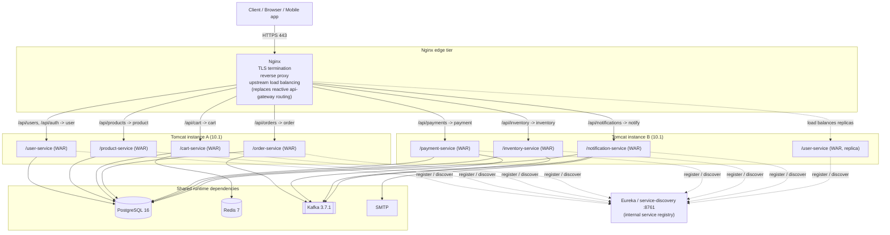

# Tomcat WAR + Nginx Deployment

> **Phase 4c** — Repackage the servlet-based **krishna.shop** services as WAR files, deploy them into an external **Apache Tomcat 10.1** container, and front the whole fleet with **Nginx** for TLS termination, reverse proxying, and upstream load balancing.

This is the "traditional application-server" deployment style. It is deliberately the **least cloud-native** of the strategies in this folder: instead of one self-contained fat jar per container (Docker/Compose in [`01`](./01-docker-compose.md) / [`02`](./02-single-ec2.md), ASG blue/green in [`03-asg-blue-green.md`](./03-asg-blue-green.md), or Kubernetes in [`05-eks.md`](./05-eks.md)), you produce WAR artifacts that share a servlet container and are load-balanced by a hand-configured Nginx tier. Choose it when your organisation already runs Tomcat + Nginx as its standard operations platform and wants these services to fit that mould.

---

## Important compatibility note (read this first)

**Not every service in this repo can run as a WAR on Tomcat.**

The `api-gateway` service is built on **Spring Cloud Gateway**, which is **reactive** — it runs on **Netty / Spring WebFlux**, not on the Servlet API. A WebFlux application **cannot** be deployed as a WAR into a servlet container such as Tomcat: `SpringBootServletInitializer` requires a `WebApplicationContext` (servlet stack), and the reactive gateway simply will not bootstrap inside `webapps/`. Do not try to WAR it.

You have two honest options for the edge, and this document covers both:

1. **Nginx becomes the edge router (recommended for this strategy).** Since you are already standing up Nginx as a reverse proxy and load balancer, let Nginx do the `/api/...` path routing that Spring Cloud Gateway would otherwise do. In this model you **drop the `api-gateway` entirely** and its routing rules are re-expressed as Nginx `location` blocks pointing at the per-service upstreams. This is the cleanest fit for a Tomcat/Nginx shop.
2. **Keep `api-gateway` as a fat jar.** If you want to preserve the gateway's filters, rate-limiting, and Eureka-based `lb://` routing, run it **unchanged as a Spring Boot fat jar** (`java -jar api-gateway.jar`) on its own host/port, and have Nginx `proxy_pass` to it. Only the *servlet* services then live on Tomcat; the gateway remains a jar.

The WAR-on-Tomcat approach therefore applies to the **servlet-based services only**:

| Service | Port | WAR-able on Tomcat? |
|---|---|---|
| config-server | 8888 | Yes (servlet) |
| service-discovery (Eureka) | 8761 | Yes (servlet) |
| user-service | 8081 | Yes |
| product-service | 8082 | Yes |
| cart-service | 8083 | Yes |
| order-service | 8084 | Yes |
| payment-service | 8085 | Yes |
| inventory-service | 8086 | Yes |
| notification-service | 8087 | Yes |
| **api-gateway** | 8080 | **No — reactive (Netty/WebFlux).** Nginx replaces it, or it stays a jar. |
| common-lib | — | Library only, never deployed |

> Note: `config-server` and `service-discovery` are servlet apps and *can* be WAR-packaged, but many teams keep them as fat jars because they must be up **before** everything else and rarely benefit from sharing a Tomcat. That is a valid hybrid.

---

## When to use / When NOT to use

**Use this strategy when:**
- Your organisation is **standardised on Tomcat/WAR operations** — existing runbooks, monitoring, `manager` app, config management, and staff skills are all built around a servlet container.
- You have a **shared, centrally-managed servlet container** tier and a policy that all JVM web apps deploy as WARs into it.
- **Nginx is already your standard edge** for TLS termination and load balancing, and you want one consistent front door.
- You need to co-locate several apps on a small number of hosts and are comfortable with container-level (rather than process-level) isolation.

**Do NOT use this strategy when:**
- You want a clean **microservice-per-artifact / per-process** model — fat jars, Docker, ASG, or EKS give you stronger isolation and independent scaling.
- Reactive components matter to you: the gateway (and any future WebFlux service) does not fit the WAR model.
- You want autoscaling, immutable infrastructure, or blue/green at the artifact level — see [`03-asg-blue-green.md`](./03-asg-blue-green.md) and [`05-eks.md`](./05-eks.md).
- A single shared Tomcat would create a **blast radius** you cannot accept (one bad deploy or OOM takes down every co-hosted service).

---

## Architecture flow diagram



Key points the diagram captures:
- **Nginx is the only public entry point.** It terminates TLS on 443 and reverse-proxies to Tomcat backends over plain HTTP inside the trusted network.
- Nginx **load-balances across multiple Tomcat instances** via `upstream` blocks — the same WAR (e.g. `user-service`) can run on two Tomcats and Nginx spreads traffic across them.
- Services are deployed as **context paths** (`/user-service`, `/order-service`, …) within Tomcat; Nginx maps public `/api/...` paths onto those contexts.
- **Eureka still runs** for internal, service-to-service discovery (e.g. order-service calling inventory-service). Nginx handles *north-south* (client→service) routing; Eureka handles *east-west* (service→service) discovery.
- Postgres, Redis, Kafka, and SMTP are shared exactly as in every other strategy.

---

## Repackaging Spring Boot as WAR

> **These are changes you must make.** The repo currently builds executable fat **jars**. To deploy on external Tomcat, each *servlet* service needs three edits. Apply them per servlet service (user, product, cart, order, payment, inventory, notification — and config-server / service-discovery if you choose to WAR them). **Do not** apply them to `api-gateway`.

### 1. Set WAR packaging and mark the embedded Tomcat `provided`

In each servlet service's `pom.xml`:

```xml
<project xmlns="http://maven.apache.org/POM/4.0.0" ...>
  <modelVersion>4.0.0</modelVersion>

  <parent>
    <groupId>shop.krishna</groupId>
    <artifactId>krishna-shop</artifactId>
    <version>1.0.0</version>
  </parent>

  <artifactId>user-service</artifactId>
  <!-- Change packaging from jar to war -->
  <packaging>war</packaging>

  <dependencies>
    <dependency>
      <groupId>org.springframework.boot</groupId>
      <artifactId>spring-boot-starter-web</artifactId>
    </dependency>

    <!--
      The embedded Tomcat must NOT be bundled into the WAR, because the
      external Tomcat 10.1 provides the servlet runtime. Mark it 'provided'
      so it is used at compile/test time but excluded from the packaged WAR.
    -->
    <dependency>
      <groupId>org.springframework.boot</groupId>
      <artifactId>spring-boot-starter-tomcat</artifactId>
      <scope>provided</scope>
    </dependency>

    <!-- ... the rest of this service's dependencies unchanged ... -->
  </dependencies>

  <build>
    <!-- Stable context path: produces target/user-service.war -->
    <finalName>${project.artifactId}</finalName>
    <plugins>
      <plugin>
        <groupId>org.springframework.boot</groupId>
        <artifactId>spring-boot-maven-plugin</artifactId>
      </plugin>
    </plugins>
  </build>
</project>
```

> **Tomcat 10.1 = Jakarta EE 10.** Spring Boot 3.2.5 already targets the `jakarta.*` namespace, so this is a match. If you were on Spring Boot 2.x / `javax.*` you would need Tomcat 9 instead — not applicable here.

### 2. Extend `SpringBootServletInitializer`

The `@SpringBootApplication` main class must also extend `SpringBootServletInitializer` and override `configure(...)` so the external container knows how to bootstrap the app. Keep the `main` method too — it lets you still run the service locally as an executable jar/`bootRun` during development.

```java
package shop.krishna.user;

import org.springframework.boot.SpringApplication;
import org.springframework.boot.autoconfigure.SpringBootApplication;
import org.springframework.boot.builder.SpringApplicationBuilder;
import org.springframework.boot.web.servlet.support.SpringBootServletInitializer;

@SpringBootApplication
public class UserServiceApplication extends SpringBootServletInitializer {

    // Used when the WAR is deployed into an external servlet container (Tomcat).
    @Override
    protected SpringApplicationBuilder configure(SpringApplicationBuilder builder) {
        return builder.sources(UserServiceApplication.class);
    }

    // Retained so the service can still be run as a standalone jar in dev.
    public static void main(String[] args) {
        SpringApplication.run(UserServiceApplication.class, args);
    }
}
```

Apply the equivalent change to each servlet service's application class (`ProductServiceApplication`, `CartServiceApplication`, `OrderServiceApplication`, `PaymentServiceApplication`, `InventoryServiceApplication`, `NotificationServiceApplication`).

> **Reminder:** none of the above has been done in the repo yet — these are the edits required to adopt this strategy. `api-gateway` stays untouched (it is either dropped in favour of Nginx routing, or kept as a fat jar).

---

## Prerequisites

Install on each Tomcat host (and Nginx on the edge host):

- **JDK 17** to build (`mvn`), and at minimum a **JRE 17** on the Tomcat hosts to run.
- **Apache Tomcat 10.1.x** (Jakarta EE 10 — matches Spring Boot 3). Set `CATALINA_HOME` (install dir) and, if you run multiple instances, distinct `CATALINA_BASE` per instance.
- **Nginx** (1.24+ recommended) on the edge host, with a valid TLS certificate (e.g. from your CA or Let's Encrypt).
- Shared runtime dependencies, reachable from the Tomcat hosts:
  - **PostgreSQL 16**
  - **Redis 7** (used by cart-service)
  - **Kafka 3.7.1** (order/payment/inventory/notification saga events)
  - **SMTP** server (notification-service email)
- Network: Tomcat HTTP connector ports open only to the Nginx tier; 443 open publicly on Nginx; Eureka `:8761` reachable between service hosts.

Verify Tomcat's Java and version:

```bash
$CATALINA_HOME/bin/version.sh   # confirm "Server version: Apache Tomcat/10.1.x" and JVM 17
```

---

## Deploy WARs to Tomcat

### 1. Build the WARs

From the repo root:

```bash
# Build every module; servlet services now produce target/<service>.war
mvn clean package

# (optional) build a single service
mvn -pl user-service -am clean package

# Skip tests for a faster packaging run in a controlled pipeline
mvn clean package -DskipTests
```

Each servlet module emits `target/<artifactId>.war` (e.g. `user-service/target/user-service.war`), thanks to `<finalName>${project.artifactId}</finalName>`.

### 2. Externalise per-service configuration

Do **not** bake environment specifics into the WAR. Supply them to Tomcat via a `setenv.sh` in `$CATALINA_BASE/bin/` (Tomcat sources it automatically). Every service needs the config-server import, the Eureka URL, and its datastore coordinates as Spring properties passed on `JAVA_OPTS`:

```bash
# $CATALINA_BASE/bin/setenv.sh   (create it; chmod +x)
export JAVA_OPTS="$JAVA_OPTS \
  -Dspring.profiles.active=prod \
  -Dspring.config.import=optional:configserver:http://config-host:8888 \
  -Deureka.client.service-url.defaultZone=http://eureka-host:8761/eureka/ \
  -Dspring.datasource.url=jdbc:postgresql://pg-host:5432/krishna \
  -Dspring.datasource.username=krishna \
  -Dspring.datasource.password=${DB_PASSWORD} \
  -Dspring.data.redis.host=redis-host \
  -Dspring.kafka.bootstrap-servers=kafka-host:9092 \
  -Xms512m -Xmx1024m"
```

> When multiple services share **one** Tomcat, they share **one** JVM and therefore one `setenv.sh`. That is a strong argument for the "one Tomcat per service" layout below, so each can be tuned and configured independently. If you must co-host, use per-context config (e.g. an external `application.properties` per context, or a shared config-server profile keyed by the app name) instead of global `JAVA_OPTS`.

### 3. Deploy the WAR (context path notes)

Tomcat derives the **context path from the WAR filename**. Dropping `user-service.war` into `webapps/` yields context `/user-service`:

```bash
# Copy the artifact into the container's autodeploy directory
cp user-service/target/user-service.war  "$CATALINA_BASE/webapps/"

# Tomcat autodeploy expands it to webapps/user-service/ and serves it at /user-service
# Watch it come up:
tail -f "$CATALINA_BASE/logs/catalina.out"
```

To deploy at the **root context** of a dedicated Tomcat instance instead (so the service owns the whole port with no path prefix), name the WAR `ROOT.war`:

```bash
cp user-service/target/user-service.war "$CATALINA_BASE/webapps/ROOT.war"
# now served at /  on that instance's connector port
```

### 4. Single shared Tomcat vs. one Tomcat per service

- **Single shared Tomcat (all WARs in one `webapps/`):** simplest to operate, fewest JVMs, lowest memory overhead. **Downside:** shared JVM heap and lifecycle — one service's memory leak, class-loading issue, or crash affects all co-hosted contexts; you cannot tune or restart them independently.
- **One Tomcat instance per service (recommended for isolation):** create a separate `CATALINA_BASE` per service (`conf/`, `logs/`, `webapps/`, `temp/`, `work/`), each with its own HTTP connector port and `setenv.sh`. Gives per-service heap sizing, independent restarts, and a smaller blast radius — at the cost of more processes to manage.

Create an isolated instance base:

```bash
# CATALINA_HOME stays the shared binaries; CATALINA_BASE is per-instance state
mkdir -p /opt/tomcat/instances/user-service/{conf,logs,webapps,temp,work,bin}
cp $CATALINA_HOME/conf/{server.xml,web.xml,context.xml} /opt/tomcat/instances/user-service/conf/
# edit server.xml -> set a unique HTTP connector port (e.g. 8081) and shutdown port
# then start with CATALINA_BASE pointed at the instance:
CATALINA_BASE=/opt/tomcat/instances/user-service $CATALINA_HOME/bin/catalina.sh start
```

- **Grouped Tomcats:** a middle ground — e.g. one Tomcat for read-heavy services (product, inventory) and one for the order/payment/cart write path.

---

## Nginx configuration

Nginx terminates TLS and load-balances to the Tomcat backends. The example below assumes each service is reachable at `host:port/<context>` on one or more Tomcat instances, and shows Nginx taking over the **edge routing that Spring Cloud Gateway used to do** (mapping public `/api/...` paths to services). Paths mirror what [`scripts/smoke-test.sh`](../../scripts/smoke-test.sh) exercises (`/api/auth`, `/api/cart`, `/api/orders`, …).

```nginx
# /etc/nginx/nginx.conf  (http context excerpt)

# ---- Upstreams: each service, one or more Tomcat backends for load balancing ----
upstream user_backend {
    least_conn;
    server 10.0.1.11:8081 max_fails=3 fail_timeout=15s;   # tomcat A /user-service
    server 10.0.1.12:8081 max_fails=3 fail_timeout=15s;   # tomcat B /user-service (replica)
    keepalive 32;
}
upstream product_backend {
    server 10.0.1.11:8082 max_fails=3 fail_timeout=15s;
    server 10.0.1.12:8082 max_fails=3 fail_timeout=15s;
    keepalive 32;
}
upstream cart_backend        { server 10.0.1.11:8083; keepalive 16; }
upstream order_backend       { server 10.0.1.11:8084; keepalive 16; }
upstream payment_backend     { server 10.0.1.13:8085; keepalive 16; }
upstream inventory_backend   { server 10.0.1.13:8086; keepalive 16; }
upstream notification_backend{ server 10.0.1.13:8087; keepalive 16; }

server {
    listen 80;
    server_name shop.krishna.example;
    # Force HTTPS
    return 301 https://$host$request_uri;
}

server {
    listen 443 ssl;
    http2 on;
    server_name shop.krishna.example;

    # ---- TLS termination at the edge ----
    ssl_certificate     /etc/nginx/tls/shop.krishna.crt;
    ssl_certificate_key /etc/nginx/tls/shop.krishna.key;
    ssl_protocols       TLSv1.2 TLSv1.3;
    ssl_ciphers         HIGH:!aNULL:!MD5;

    # Common proxy headers so services see the real client + scheme
    proxy_set_header Host              $host;
    proxy_set_header X-Real-IP         $remote_addr;
    proxy_set_header X-Forwarded-For   $proxy_add_x_forwarded_for;
    proxy_set_header X-Forwarded-Proto $scheme;
    proxy_http_version 1.1;
    proxy_set_header Connection "";

    # ---------------------------------------------------------------
    # Edge routing that REPLACES the reactive api-gateway.
    # Public /api/<area>  ->  the owning service's Tomcat context.
    # The rewrite strips the /api prefix onto the service context path.
    # ---------------------------------------------------------------

    # auth + users -> user-service (context /user-service)
    location /api/auth/     { proxy_pass http://user_backend/user-service/api/auth/; }
    location /api/users/    { proxy_pass http://user_backend/user-service/api/users/; }

    location /api/products/ { proxy_pass http://product_backend/product-service/api/products/; }
    location /api/cart/     { proxy_pass http://cart_backend/cart-service/api/cart/; }
    location /api/orders/   { proxy_pass http://order_backend/order-service/api/orders/; }
    location /api/payments/ { proxy_pass http://payment_backend/payment-service/api/payments/; }
    location /api/inventory/{ proxy_pass http://inventory_backend/inventory-service/api/inventory/; }
    location /api/notifications/ {
        proxy_pass http://notification_backend/notification-service/api/notifications/;
    }

    # Passive health / readiness (Spring Boot Actuator per context)
    location = /healthz {
        proxy_pass http://user_backend/user-service/actuator/health;
        access_log off;
    }
}
```

Notes:
- **`least_conn` / round-robin + `max_fails`/`fail_timeout`** give you passive health checking and load balancing across Tomcat backends for free in open-source Nginx. Nginx Plus adds active `health_check` probes; with OSS you can approximate them by pointing a `location` at each backend's `/actuator/health`.
- **If you keep the gateway as a jar instead**, replace all the per-service `location /api/...` blocks with a single `upstream gateway_backend { server 10.0.1.20:8080; }` and one `location /api/ { proxy_pass http://gateway_backend; }` — Nginx then only does TLS + LB, and Spring Cloud Gateway does the routing.
- Trailing-slash alignment between `location` and `proxy_pass` matters: the pattern above rewrites `/api/orders/…` onto `/order-service/api/orders/…` so it lands on the Tomcat context correctly. Adjust to match each service's actual controller base paths.

Reload after editing:

```bash
nginx -t && nginx -s reload
```

---

## Verification

1. **Hit Nginx (public edge):**
   ```bash
   curl -fsSk https://shop.krishna.example/healthz
   curl -fsSk https://shop.krishna.example/api/products/
   ```
2. **Check Tomcat directly** (from inside the network) and inspect logs:
   ```bash
   curl -fsS http://10.0.1.11:8082/product-service/actuator/health
   tail -f "$CATALINA_BASE/logs/catalina.out"     # deployment + startup errors
   # If the Manager app is installed:
   curl -u tomcat:*** http://10.0.1.11:8082/manager/text/list
   ```
3. **Confirm Eureka registrations** — every deployed service should appear in the registry:
   ```bash
   curl -fsS http://eureka-host:8761/          # dashboard (browser)
   curl -fsS http://eureka-host:8761/eureka/apps | grep -i '<app>'
   ```
4. **Run the end-to-end smoke test through Nginx.** Point its `GATEWAY` variable at the Nginx URL (it defaults to `http://localhost:8080`):
   ```bash
   GATEWAY="https://shop.krishna.example" bash scripts/smoke-test.sh
   ```
   This registers a user, logs in, adds a product to the cart, places an order, and polls until the saga settles to `CONFIRMED` — exercising the full path through Nginx → Tomcat WARs → Postgres/Redis/Kafka.

---

## Rollback

WAR-on-Tomcat rollback is fast because Tomcat supports **hot (un)deploy** and WARs are cheap to version.

- **Keep versioned WARs.** Archive each release as `user-service-1.0.0.war`, `user-service-1.0.1.war`, … in an artifact store or a `releases/` directory on the host. Deploy is a copy; rollback is copying the previous version back.
- **Undeploy current / redeploy previous:**
  ```bash
  # Remove the running context (Tomcat autodeploy deletes the exploded dir)
  rm "$CATALINA_BASE/webapps/user-service.war"
  rm -rf "$CATALINA_BASE/webapps/user-service"

  # Put the known-good previous version back
  cp releases/user-service-1.0.0.war "$CATALINA_BASE/webapps/user-service.war"
  tail -f "$CATALINA_BASE/logs/catalina.out"
  ```
  Or drive it via the Manager app:
  ```bash
  curl -u tomcat:*** "http://host:8082/manager/text/undeploy?path=/user-service"
  curl -u tomcat:*** -T releases/user-service-1.0.0.war \
       "http://host:8082/manager/text/deploy?path=/user-service&update=true"
  ```
- **Drain traffic at Nginx first.** Before undeploying a backend, mark it `down` (or remove it from the `upstream`) and reload Nginx so in-flight requests finish and no new ones arrive:
  ```nginx
  upstream user_backend {
      server 10.0.1.11:8081 down;          # draining node
      server 10.0.1.12:8081;               # keeps serving
  }
  ```
  ```bash
  nginx -s reload
  ```
  With two Tomcat backends per service you can roll one node at a time for a near-zero-downtime rollback.

---

## Scaling & HA

- **Scale horizontally by adding Tomcat nodes** to each service's Nginx `upstream`. Nginx spreads load (`least_conn` / round-robin) and ejects unhealthy nodes via `max_fails`/`fail_timeout`. Services are stateless (JWT auth, no HTTP session affinity needed), so replicas are interchangeable.
- **Nginx is the load balancer.** For HA of the edge itself, run **two Nginx nodes** behind a virtual IP (keepalived) or a cloud L4 load balancer, so the front door is not a single point of failure.
- **Eureka** continues to handle east-west discovery between services; run 2+ Eureka replicas for registry HA.
- **Datastore HA** (Postgres replicas/failover, Redis Sentinel/Cluster, multi-broker Kafka) is orthogonal and shared with the other strategies.

**Contrast with the cloud-native strategies:**
- **[`03-asg-blue-green.md`](./03-asg-blue-green.md)** — an AWS **ALB + Auto Scaling Group** scales instances automatically and does blue/green at the fleet level. Here, *you* add Tomcat nodes and reload Nginx by hand; scaling is manual and the LB (Nginx) is self-managed rather than a managed ALB.
- **[`05-eks.md`](./05-eks.md)** — **Kubernetes** gives you per-service Deployments, HPA autoscaling, rolling updates, self-healing, and a managed ingress. The WAR/Tomcat model trades all of that automation for fit with an existing servlet-container operations practice.

---

## Pros / Cons

| Pros | Cons |
|---|---|
| Fits organisations already standardised on **Tomcat + Nginx** ops, tooling, and skills | **Least cloud-native** option here; runs against the microservice-per-artifact grain |
| **Hot (un)deploy** of WARs makes deploy/rollback quick, with easy versioned artifacts | **Reactive `api-gateway` cannot be WAR'd** — needs Nginx edge routing or a separate jar |
| **Shared container** reduces per-service memory/JVM overhead when co-hosting | Shared Tomcat = shared JVM = larger **blast radius** (one bad app affects neighbours) |
| Nginx gives **TLS termination + LB + edge routing** in one well-understood tier | Requires **code changes** (WAR packaging, `provided` Tomcat, `SpringBootServletInitializer`) |
| Runs on plain VMs/on-prem — **no container platform or cloud dependency** | **Manual scaling & HA** — no autoscaling, self-healing, or managed LB out of the box |
| Mature, battle-tested runtime (Tomcat/Nginx) with deep operational knowledge | More moving parts to configure by hand (`setenv.sh`, `server.xml`, upstreams, drains) |

---

## Cost

Rough, order-of-magnitude guidance (self-managed, excludes datastores):

- **Compute:** a couple of Tomcat hosts plus an Nginx host. On AWS, e.g. 2× `t3.large` for Tomcat + 1× `t3.small` for Nginx is roughly **~$150–200/month** on-demand (less with reserved/savings plans, or near-zero incremental on existing on-prem hardware).
- **No managed-service premium:** unlike ALB/ASG ([`03`](./03-asg-blue-green.md)) or EKS ([`05`](./05-eks.md)), there is no load-balancer-hour or control-plane fee — Nginx and Tomcat are free/open-source. You trade that saving for **operational labour**: patching, scaling, HA, and monitoring are yours to run.
- **Shared datastores** (Postgres 16, Redis 7, Kafka 3.7.1, SMTP) cost the same regardless of strategy and dominate at scale.

Net: cheapest in licensing/infra fees, potentially the most expensive in **engineering time** — which is exactly why it makes sense only when a Tomcat/Nginx operations practice already exists.
