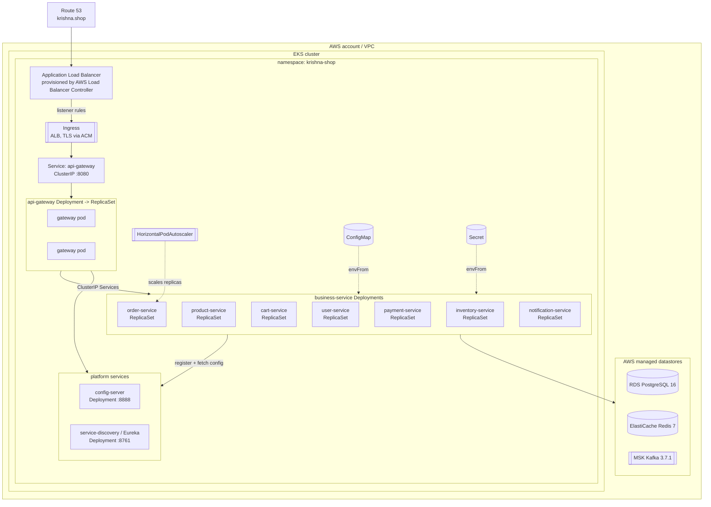

# Amazon EKS (Kubernetes) Deployment

Run the entire **krishna.shop** platform — config-server, service-discovery (Eureka), api-gateway, and all seven business services — as containerised workloads on an Amazon EKS cluster, fronted by an Application Load Balancer and backed by AWS-managed datastores (RDS, ElastiCache, MSK).

> **This is Phase 4d — the most cloud-native / production-grade option.** It gives you declarative deploys, self-healing pods, horizontal autoscaling, rolling/blue-green/canary rollouts, and first-class observability. It is also the most operationally involved: you own a Kubernetes control plane, node groups, IAM/IRSA, and a set of controllers. Measure it against the single-host baseline in [`01-ec2-docker-compose.md`](./01-ec2-docker-compose.md) and the VM-level blue/green in [`03-asg-blue-green.md`](./03-asg-blue-green.md).

---

## When to use / When NOT to use

**Use this when:**

- You need high availability across multiple AZs with automatic pod rescheduling and node replacement.
- You want to scale each service independently under real load (HPA on CPU/memory/custom metrics).
- You require zero-downtime deploys with rolling updates, plus the option of blue/green or canary via labels or Argo Rollouts.
- You already run — or want to run — managed datastores (RDS PostgreSQL 16, ElastiCache Redis 7, MSK Kafka 3.7.1) and wire them in through ConfigMap/Secret.
- You have (or are building) a platform team comfortable operating Kubernetes, and you want a consistent target for CI/CD across many services.

**Do NOT use this when:**

- You need a running environment in an afternoon for a demo or QA — use [`01-ec2-docker-compose.md`](./01-ec2-docker-compose.md).
- Cost is the dominant constraint. EKS adds a control-plane charge on top of always-on nodes, load balancers, and managed datastores.
- Your team has no Kubernetes operational experience and no time to build it — the failure modes (networking, IRSA, DNS, probes) are non-obvious.
- The workload is small and stable enough that VM-level blue/green ([`03-asg-blue-green.md`](./03-asg-blue-green.md)) already meets your availability and deploy requirements.

---

## Architecture flow diagram



The namespace `krishna-shop` is the boundary for all workloads. `ConfigMap` and `Secret` feed configuration into pods via `envFrom`; the `HorizontalPodAutoscaler` adjusts replica counts per service. Traffic enters at Route 53 → ALB (Ingress) → api-gateway, which routes to the business services; every service registers with Eureka and pulls central config from config-server.

---

## Prerequisites

| Requirement | Notes |
| --- | --- |
| **EKS cluster** | Provisioned with `eksctl` or Terraform. Kubernetes 1.29+, one or more managed node groups spanning ≥2 AZs. |
| **`kubectl`** | Configured against the cluster: `aws eks update-kubeconfig --name krishna-shop --region <region>`. |
| **`helm`** | v3, for installing controllers (AWS LB Controller, metrics-server) and, optionally, the app itself. |
| **ECR repositories** | One repo per service (`krishna-shop/config-server`, `.../api-gateway`, `.../user-service`, …). |
| **AWS Load Balancer Controller** | Installed via Helm; provisions the ALB from the `Ingress` object. Requires an IAM policy + IRSA service account. |
| **metrics-server** | Required for HPA to read CPU/memory. `helm install metrics-server metrics-server/metrics-server -n kube-system`. |
| **EBS CSI driver** | Managed add-on; required for any `PersistentVolumeClaim` (e.g. in-cluster datastores in non-prod). |
| **IAM / IRSA** | OIDC provider associated with the cluster; IAM roles bound to service accounts for the LB controller, EBS CSI driver, and any pod needing AWS API access. |
| **Managed datastores** | RDS PostgreSQL 16, ElastiCache Redis 7, MSK Kafka 3.7.1 reachable from the node subnets (security groups allow the cluster CIDR). |

> **Non-prod alternative:** instead of RDS/ElastiCache/MSK you may run PostgreSQL, Redis, and Kafka in-cluster as `StatefulSet`s with `PersistentVolumeClaim`s backed by the EBS CSI driver. This is fine for dev/QA but does not give you managed backups, replication, or failover — do not use it for production.

---

## Build & push images to ECR

Every service is built from the repo's single parameterized multi-stage `Dockerfile` using `--build-arg MODULE=<service>`. Push each resulting image to its own ECR repository.

```bash
#!/usr/bin/env bash
set -euo pipefail

AWS_REGION="us-east-1"
AWS_ACCOUNT_ID="$(aws sts get-caller-identity --query Account --output text)"
REGISTRY="${AWS_ACCOUNT_ID}.dkr.ecr.${AWS_REGION}.amazonaws.com"
TAG="1.0.0"

SERVICES=(
  config-server
  service-discovery
  api-gateway
  user-service
  product-service
  cart-service
  order-service
  payment-service
  inventory-service
  notification-service
)

# One-time login to ECR
aws ecr get-login-password --region "${AWS_REGION}" \
  | docker login --username AWS --password-stdin "${REGISTRY}"

for SVC in "${SERVICES[@]}"; do
  REPO="krishna-shop/${SVC}"

  # Create the ECR repo if it does not exist (idempotent)
  aws ecr describe-repositories --repository-names "${REPO}" --region "${AWS_REGION}" >/dev/null 2>&1 \
    || aws ecr create-repository --repository-name "${REPO}" --region "${AWS_REGION}" >/dev/null

  # Build from the single parameterized Dockerfile at the repo root
  docker build \
    --build-arg MODULE="${SVC}" \
    -t "${REGISTRY}/${REPO}:${TAG}" \
    -t "${REGISTRY}/${REPO}:latest" \
    .

  docker push "${REGISTRY}/${REPO}:${TAG}"
  docker push "${REGISTRY}/${REPO}:latest"
done
```

> `MODULE` is the Maven module directory name. `config-server`, `service-discovery`, `api-gateway`, and the seven `*-service` modules each produce an image; `common-lib` is a library only and is never containerised — it is consumed at build time.

---

## Kubernetes manifests

Below is the **complete, canonical manifest set for `order-service`**. Every other service (user, product, cart, payment, inventory, notification, api-gateway, config-server, service-discovery) follows exactly the same pattern — change the name, the ECR image, the container port, and any service-specific config keys. Keep these under `k8s/` in the repo (e.g. `k8s/order-service.yaml`).

### Namespace

```yaml
apiVersion: v1
kind: Namespace
metadata:
  name: krishna-shop
  labels:
    app.kubernetes.io/part-of: krishna-shop
```

### ConfigMap (non-secret config)

```yaml
apiVersion: v1
kind: ConfigMap
metadata:
  name: order-service-config
  namespace: krishna-shop
  labels:
    app: order-service
data:
  # Pull central config from the in-cluster config-server (kept from the codebase)
  SPRING_CONFIG_IMPORT: "optional:configserver:http://config-server:8888"
  SPRING_PROFILES_ACTIVE: "kubernetes"
  # Register with Eureka running as a normal Deployment/Service in this namespace
  EUREKA_CLIENT_SERVICEURL_DEFAULTZONE: "http://service-discovery:8761/eureka/"
  EUREKA_INSTANCE_PREFERIPADDRESS: "true"
  # Kafka bootstrap -> MSK (or in-cluster kafka Service for non-prod)
  SPRING_KAFKA_BOOTSTRAP_SERVERS: "b-1.krishna-shop.abcde.c2.kafka.us-east-1.amazonaws.com:9092,b-2.krishna-shop.abcde.c2.kafka.us-east-1.amazonaws.com:9092"
  # Datastore hosts (non-secret parts)
  SPRING_DATASOURCE_URL: "jdbc:postgresql://order-db.abcde.us-east-1.rds.amazonaws.com:5432/orderdb"
  SPRING_DATA_REDIS_HOST: "krishna-shop-redis.abcde.ng.0001.use1.cache.amazonaws.com"
  SPRING_DATA_REDIS_PORT: "6379"
  MANAGEMENT_ENDPOINTS_WEB_EXPOSURE_INCLUDE: "health,info,prometheus"
  MANAGEMENT_ENDPOINT_HEALTH_PROBES_ENABLED: "true"
```

### Secret (credentials)

```yaml
apiVersion: v1
kind: Secret
metadata:
  name: order-service-secret
  namespace: krishna-shop
  labels:
    app: order-service
type: Opaque
# stringData lets you write plaintext; Kubernetes base64-encodes it on write.
# In production, source these from AWS Secrets Manager via the External Secrets
# Operator or the Secrets Store CSI driver instead of committing them.
stringData:
  SPRING_DATASOURCE_USERNAME: "orderuser"
  SPRING_DATASOURCE_PASSWORD: "REPLACE_ME_STRONG_PASSWORD"
  SPRING_DATA_REDIS_PASSWORD: "REPLACE_ME_REDIS_AUTH_TOKEN"
```

### Deployment

```yaml
apiVersion: apps/v1
kind: Deployment
metadata:
  name: order-service
  namespace: krishna-shop
  labels:
    app: order-service
    app.kubernetes.io/part-of: krishna-shop
spec:
  replicas: 2
  selector:
    matchLabels:
      app: order-service
  strategy:
    type: RollingUpdate
    rollingUpdate:
      maxUnavailable: 0
      maxSurge: 1
  template:
    metadata:
      labels:
        app: order-service
      annotations:
        prometheus.io/scrape: "true"
        prometheus.io/port: "8084"
        prometheus.io/path: "/actuator/prometheus"
    spec:
      containers:
        - name: order-service
          image: 111122223333.dkr.ecr.us-east-1.amazonaws.com/krishna-shop/order-service:1.0.0
          imagePullPolicy: IfNotPresent
          ports:
            - name: http
              containerPort: 8084
          envFrom:
            - configMapRef:
                name: order-service-config
            - secretRef:
                name: order-service-secret
          env:
            # Let the JVM respect the container memory limit
            - name: JAVA_TOOL_OPTIONS
              value: "-XX:MaxRAMPercentage=75.0 -XX:InitialRAMPercentage=50.0"
          resources:
            requests:
              cpu: "250m"
              memory: "512Mi"
            limits:
              cpu: "1000m"
              memory: "1Gi"
          startupProbe:
            # Give Spring Boot time to boot before liveness kicks in
            httpGet:
              path: /actuator/health/readiness
              port: http
            failureThreshold: 30
            periodSeconds: 5
          livenessProbe:
            httpGet:
              path: /actuator/health/liveness
              port: http
            initialDelaySeconds: 10
            periodSeconds: 15
            failureThreshold: 3
          readinessProbe:
            httpGet:
              path: /actuator/health/readiness
              port: http
            initialDelaySeconds: 10
            periodSeconds: 10
            failureThreshold: 3
```

> **Probe note:** Spring Boot Actuator exposes an aggregate endpoint at `/actuator/health` and, when `management.endpoint.health.probes.enabled=true` (set in the ConfigMap above), split probes at `/actuator/health/liveness` and `/actuator/health/readiness`. The split endpoints are preferred on Kubernetes because readiness flips independently of liveness. If a service does not enable the split probes, point all three probes at `/actuator/health`.

### Service (ClusterIP)

```yaml
apiVersion: v1
kind: Service
metadata:
  name: order-service
  namespace: krishna-shop
  labels:
    app: order-service
spec:
  type: ClusterIP
  selector:
    app: order-service
  ports:
    - name: http
      port: 8084
      targetPort: http
```

### HorizontalPodAutoscaler

```yaml
apiVersion: autoscaling/v2
kind: HorizontalPodAutoscaler
metadata:
  name: order-service
  namespace: krishna-shop
spec:
  scaleTargetRef:
    apiVersion: apps/v1
    kind: Deployment
    name: order-service
  minReplicas: 2
  maxReplicas: 10
  metrics:
    - type: Resource
      resource:
        name: cpu
        target:
          type: Utilization
          averageUtilization: 70
  behavior:
    scaleDown:
      stabilizationWindowSeconds: 300
```

### NetworkPolicy

Default-deny for the service, then explicitly allow only the traffic it needs: ingress from the api-gateway on 8084, and egress to DNS, the datastores, config-server, and Eureka.

```yaml
apiVersion: networking.k8s.io/v1
kind: NetworkPolicy
metadata:
  name: order-service
  namespace: krishna-shop
spec:
  podSelector:
    matchLabels:
      app: order-service
  policyTypes:
    - Ingress
    - Egress
  ingress:
    # Only the api-gateway may call order-service
    - from:
        - podSelector:
            matchLabels:
              app: api-gateway
      ports:
        - protocol: TCP
          port: 8084
  egress:
    # DNS resolution
    - to:
        - namespaceSelector: {}
      ports:
        - protocol: UDP
          port: 53
        - protocol: TCP
          port: 53
    # config-server + Eureka
    - to:
        - podSelector:
            matchLabels:
              app: config-server
        - podSelector:
            matchLabels:
              app: service-discovery
      ports:
        - protocol: TCP
          port: 8888
        - protocol: TCP
          port: 8761
    # External managed datastores (RDS 5432, ElastiCache 6379, MSK 9092)
    - to:
        - ipBlock:
            cidr: 0.0.0.0/0
      ports:
        - protocol: TCP
          port: 5432
        - protocol: TCP
          port: 6379
        - protocol: TCP
          port: 9092
```

> Tighten the egress `ipBlock` to the actual RDS/ElastiCache/MSK subnet CIDRs in production rather than `0.0.0.0/0`.

### Ingress (ALB + TLS)

One Ingress for the whole platform; all external traffic terminates TLS at the ALB (certificate from ACM) and routes to the api-gateway Service. The gateway is the only externally reachable service — everything else stays ClusterIP-internal.

```yaml
apiVersion: networking.k8s.io/v1
kind: Ingress
metadata:
  name: krishna-shop
  namespace: krishna-shop
  annotations:
    kubernetes.io/ingress.class: alb
    alb.ingress.kubernetes.io/scheme: internet-facing
    alb.ingress.kubernetes.io/target-type: ip
    alb.ingress.kubernetes.io/listen-ports: '[{"HTTP":80},{"HTTPS":443}]'
    alb.ingress.kubernetes.io/ssl-redirect: '443'
    alb.ingress.kubernetes.io/certificate-arn: arn:aws:acm:us-east-1:111122223333:certificate/xxxxxxxx-xxxx-xxxx-xxxx-xxxxxxxxxxxx
    alb.ingress.kubernetes.io/healthcheck-path: /actuator/health
spec:
  rules:
    - host: api.krishna.shop
      http:
        paths:
          - path: /
            pathType: Prefix
            backend:
              service:
                name: api-gateway
                port:
                  number: 8080
```

### PersistentVolumeClaim (in-cluster datastore case only)

Business services are **stateless** and need no PVC. A PVC is only relevant when you run a datastore in-cluster for non-prod (e.g. a PostgreSQL `StatefulSet`). Example claim backed by the EBS CSI driver:

```yaml
apiVersion: v1
kind: PersistentVolumeClaim
metadata:
  name: postgres-data
  namespace: krishna-shop
spec:
  accessModes:
    - ReadWriteOnce
  storageClassName: gp3           # backed by the EBS CSI driver
  resources:
    requests:
      storage: 20Gi
```

> **Every service follows the order-service pattern above.** Duplicate the Deployment/Service/ConfigMap/Secret/HPA/NetworkPolicy set per service, substituting the name, ECR image, and port (`config-server` 8888, `service-discovery` 8761, `api-gateway` 8080, `user-service` 8081, `product-service` 8082, `cart-service` 8083, `order-service` 8084, `payment-service` 8085, `inventory-service` 8086, `notification-service` 8087). `config-server` and `service-discovery` do not need a NetworkPolicy ingress restricted to the gateway — they accept traffic from all app pods.

> **K8s-native alternative (note):** the manifests above keep Eureka + config-server as normal Deployments because that matches the codebase — services still register with Eureka and import config from config-server. A more Kubernetes-native design drops both: use Kubernetes `Service` DNS for discovery (call `http://order-service:8084` directly) and mount all configuration from `ConfigMap`/`Secret`, removing the config-server and Eureka Deployments entirely. This is cleaner on Kubernetes but is a larger change to the application's Spring Cloud wiring, so it is presented only as a future option.

---

## Deploy

Apply in dependency order so config-server and Eureka are up before the services that depend on them. Assuming per-service files under `k8s/`:

```bash
# 1. Namespace first
kubectl apply -f k8s/namespace.yaml

# 2. Platform services: config-server, then service-discovery (Eureka)
kubectl apply -f k8s/config-server.yaml
kubectl -n krishna-shop rollout status deploy/config-server

kubectl apply -f k8s/service-discovery.yaml
kubectl -n krishna-shop rollout status deploy/service-discovery

# 3. Gateway + business services (order independent among themselves)
kubectl apply -f k8s/api-gateway.yaml
kubectl apply -f k8s/user-service.yaml
kubectl apply -f k8s/product-service.yaml
kubectl apply -f k8s/cart-service.yaml
kubectl apply -f k8s/order-service.yaml
kubectl apply -f k8s/payment-service.yaml
kubectl apply -f k8s/inventory-service.yaml
kubectl apply -f k8s/notification-service.yaml

# Or apply everything at once (Kubernetes reconciles regardless of order):
kubectl apply -f k8s/

# Watch pods come up
kubectl -n krishna-shop get pods -w
```

> **Helm option:** package the per-service pattern as a single chart with a values file per service (`image`, `port`, `replicas`, config keys) and `helm upgrade --install krishna-shop ./chart -n krishna-shop`. This is the recommended approach once you have more than a handful of services, since it removes the copy-paste duplication.

---

## Verification

```bash
# Everything in the namespace
kubectl -n krishna-shop get pods,svc,ingress

# Logs for a specific service
kubectl -n krishna-shop logs deploy/order-service -f

# The ALB DNS name (target for Route 53 alias record)
kubectl -n krishna-shop get ingress krishna-shop \
  -o jsonpath='{.status.loadBalancer.ingress[0].hostname}'; echo

# Actuator health straight from a pod
kubectl -n krishna-shop exec deploy/order-service -- \
  wget -qO- http://localhost:8084/actuator/health

# End-to-end smoke test against the Ingress host
INGRESS_HOST="$(kubectl -n krishna-shop get ingress krishna-shop \
  -o jsonpath='{.status.loadBalancer.ingress[0].hostname}')"
BASE_URL="https://${INGRESS_HOST}" bash scripts/smoke-test.sh

# Confirm HPA is reading metrics (TARGETS must not show <unknown>)
kubectl -n krishna-shop get hpa
```

Expected: all pods `Running` and `READY 1/1` (or `2/2` at the configured replica count), every service registered in the Eureka dashboard, `get hpa` showing real CPU percentages (metrics-server working), and the smoke test completing the order saga through the Ingress.

---

## Rollout & rollback

Rolling update is the default strategy (`RollingUpdate` with `maxUnavailable: 0`, `maxSurge: 1` in the Deployment above), so a new version rolls out one pod at a time with no downtime.

```bash
# Ship a new image tag
kubectl -n krishna-shop set image deploy/order-service \
  order-service=111122223333.dkr.ecr.us-east-1.amazonaws.com/krishna-shop/order-service:1.1.0

# Watch the rollout
kubectl -n krishna-shop rollout status deploy/order-service

# Roll back to the previous ReplicaSet if it goes wrong
kubectl -n krishna-shop rollout undo deploy/order-service

# Inspect history / roll back to a specific revision
kubectl -n krishna-shop rollout history deploy/order-service
kubectl -n krishna-shop rollout undo deploy/order-service --to-revision=3
```

**Beyond rolling updates:**

- **Blue/green:** run a second Deployment (`order-service-green`) alongside the current one and flip the Service `selector` (e.g. `version: green`) once the green pods are healthy. Instant cutover, instant rollback by flipping back.
- **Canary:** label a small second Deployment and let both back the same Service so a fraction of pods serve the new version; scale it up gradually.
- **Argo Rollouts:** for automated, metric-gated canary/blue-green with analysis and auto-rollback, replace the `Deployment` with an Argo `Rollout` resource. Recommended once progressive delivery becomes a routine need.

---

## Autoscaling

Two independent layers:

- **Pods — HorizontalPodAutoscaler.** The HPA shown above scales `order-service` between 2 and 10 replicas at 70% average CPU. Add memory or custom/Prometheus metrics (via the Prometheus Adapter) for finer control. Requires metrics-server.
- **Nodes — Cluster Autoscaler or Karpenter.** When pods cannot be scheduled for lack of capacity, the node layer adds nodes; when nodes are underused, it removes them. **Cluster Autoscaler** scales existing node groups (ASGs); **Karpenter** provisions right-sized nodes directly and is generally faster and more efficient on EKS. Run one of them so HPA-driven pod growth actually finds somewhere to land.

---

## Observability

- **Metrics:** each service exposes Micrometer metrics at `/actuator/prometheus` (enabled via `management.endpoints.web.exposure.include=prometheus` in the ConfigMap, and advertised by the pod annotations). Deploy the **kube-prometheus-stack** Helm chart (Prometheus Operator + Prometheus + Grafana + Alertmanager) and create a `ServiceMonitor` per service so Prometheus scrapes it:

```yaml
apiVersion: monitoring.coreos.com/v1
kind: ServiceMonitor
metadata:
  name: order-service
  namespace: krishna-shop
  labels:
    release: kube-prometheus-stack
spec:
  selector:
    matchLabels:
      app: order-service
  endpoints:
    - port: http
      path: /actuator/prometheus
      interval: 15s
```

- **Dashboards:** Grafana (bundled with the stack) visualises the scraped metrics — JVM, HTTP, Kafka consumer lag, and the HPA's driving signals.
- This links to the project's dedicated observability phase; see the sibling deployment docs and the observability documentation for the shared Prometheus/Grafana/tracing setup rather than duplicating dashboards here.

---

## Pros / Cons

| Pros | Cons |
| --- | --- |
| Multi-AZ high availability; pods and nodes self-heal. | Highest operational complexity of all strategies — you own a control plane, controllers, IRSA, and networking. |
| Independent per-service horizontal autoscaling (HPA). | Steep learning curve; failure modes (DNS, probes, NetworkPolicy, IRSA) are non-obvious. |
| Zero-downtime rolling updates, plus blue/green and canary options. | Most expensive: EKS control-plane fee + always-on nodes + ALB + managed datastores. |
| Declarative, GitOps-friendly manifests; consistent CI/CD target across all services. | More moving parts to secure and patch (nodes, add-ons, controllers). |
| First-class integration with AWS managed datastores (RDS, ElastiCache, MSK) and ALB. | Overkill for demos, small deployments, or teams without Kubernetes experience. |
| Rich observability ecosystem (Prometheus Operator, ServiceMonitors, Grafana). | Requires ongoing platform ownership, not a one-time setup. |

---

## Cost

Rough monthly order of magnitude (varies by region, usage, and commitments):

- **EKS control plane:** ~$0.10/hour per cluster (~$73/month), fixed regardless of workload.
- **Worker nodes:** the main variable cost — e.g. 3× `m5.large` on-demand ≈ $200–210/month; use Spot for stateless services and Savings Plans/Reserved for the baseline to cut this substantially.
- **ALB:** ~$16–25/month plus LCU charges based on traffic.
- **Managed datastores:** RDS PostgreSQL, ElastiCache Redis, and MSK Kafka are each billed separately and often dominate the bill — size them per environment.
- **Add-ons:** NAT gateways, EBS volumes, CloudWatch/Prometheus storage, and cross-AZ data transfer add incremental cost.

Control cost with Spot node pools (or Karpenter consolidation) for stateless workloads, right-sized `requests`/`limits`, aggressive HPA `scaleDown`, and shared non-prod clusters. For low-traffic or demo needs, the single-host [`01-ec2-docker-compose.md`](./01-ec2-docker-compose.md) is dramatically cheaper.
