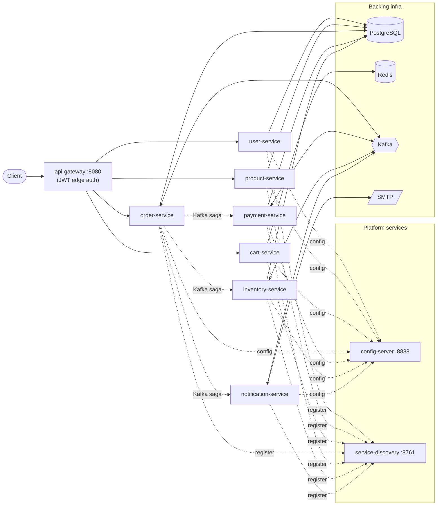
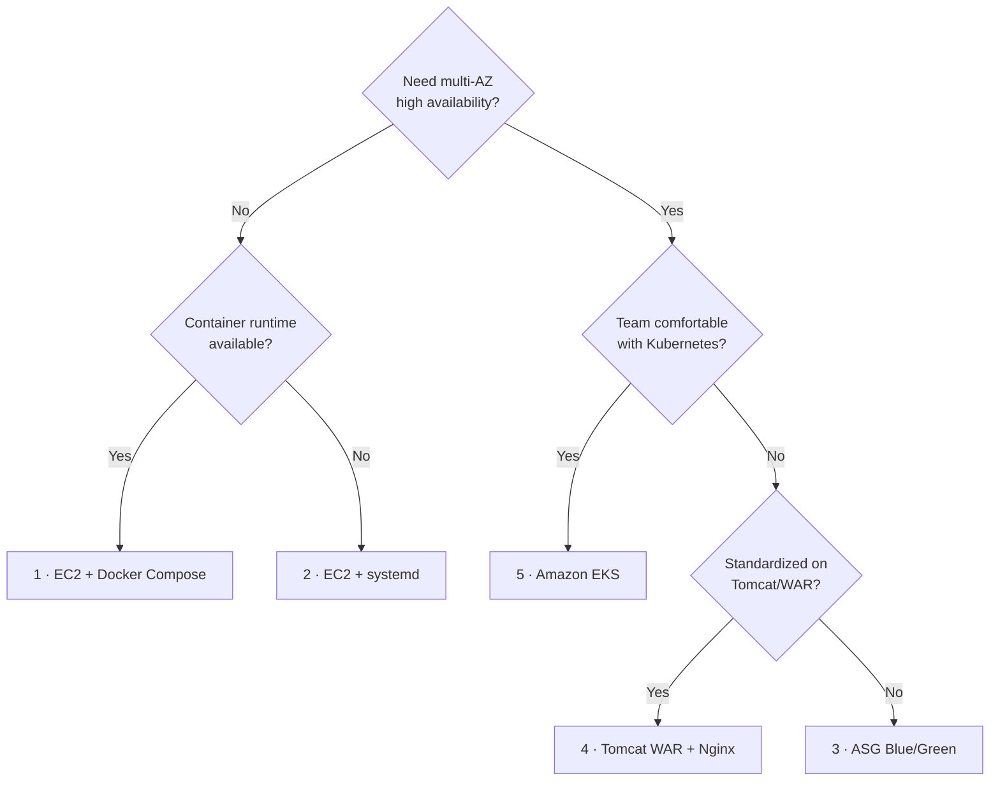

# krishna.shop — Deployment Strategies

This directory documents **every way the krishna.shop platform can be deployed**, from the simplest single-host setup to a full production-grade Kubernetes cluster. Each strategy has its own detailed README with a flow diagram, prerequisites, step-by-step instructions, configuration, verification, and rollback.

These correspond to **Phase 4 (Deployment strategies)** of the platform roadmap.

---

## The platform being deployed

krishna.shop is a Java 17 / Spring Boot 3.2.5 / Spring Cloud 2023.0.1 microservices e-commerce platform. Regardless of *how* it is deployed, the moving parts are the same:

| Component | Port | Role |
|-----------|------|------|
| `config-server` | 8888 | Spring Cloud Config Server (serves `config-repo/`) |
| `service-discovery` | 8761 | Netflix Eureka registry |
| `api-gateway` | 8080 | Spring Cloud Gateway — **public entrypoint**, JWT edge auth |
| `user-service` | 8081 | Accounts & auth |
| `product-service` | 8082 | Catalog |
| `cart-service` | 8083 | Cart (Redis-backed) |
| `order-service` | 8084 | Orders + saga orchestration |
| `payment-service` | 8085 | Payments |
| `inventory-service` | 8086 | Stock reservation |
| `notification-service` | 8087 | Email notifications |

**Backing infrastructure:** PostgreSQL 16 (per-service DBs), Redis 7, Apache Kafka 3.7.1 (KRaft), an SMTP server, and Zipkin for tracing. `common-lib` is a shared library, not a deployed service.



---

## The five strategies

| # | Strategy | Phase | HA | Zero-downtime | Rollback speed | Ops complexity | Best for |
|---|----------|-------|----|----|----|----|----|
| 1 | **[EC2 + Docker Compose](01-ec2-docker-compose.md)** | 4 (baseline) | ❌ single host | ❌ | Medium (rebuild) | 🟢 Low | Dev, demos, the current running setup |
| 2 | **[EC2 + systemd](02-ec2-systemd.md)** (fat jars) | 4a | ❌ single host | ❌ | Fast (symlink swap) | 🟢 Low | VM shops with no container runtime |
| 3 | **[ASG Blue/Green](03-asg-blue-green.md)** | 4b | ✅ multi-AZ | ✅ | ⚡ Instant (listener swap) | 🟡 Medium | Production on EC2 — **the next milestone** |
| 4 | **[Tomcat WAR + Nginx](04-tomcat-war-nginx.md)** | 4c | ⚠️ via Nginx LB | ⚠️ (hot redeploy) | Medium (redeploy WAR) | 🟡 Medium | Orgs standardized on Tomcat/WAR |
| 5 | **[Amazon EKS (Kubernetes)](05-eks.md)** | 4d | ✅ self-healing | ✅ rolling/canary | ⚡ `rollout undo` | 🔴 High | Full production, elastic scale |

---

## Which one should I use?



- **Just want it running / learning?** → Strategy 1 (you already have this).
- **Production on EC2 without Kubernetes?** → Strategy 3 (ASG blue/green) — this is the platform's designated next step.
- **Going fully cloud-native / need elastic scale?** → Strategy 5 (EKS).
- **Constrained to traditional app-server ops?** → Strategy 4 (Tomcat WAR).
- **VMs, no Docker?** → Strategy 2 (systemd).

---

## Progression

The strategies are ordered as a natural maturity path:

```
1. Docker Compose (1 host)   →   3. ASG Blue/Green (fleet + ALB)   →   5. EKS (orchestrated)
        ↑ where you are today          ↑ next milestone (Phase 4b)          ↑ end state (Phase 4d)
```

Strategies 2 and 4 are alternative styles for environments with specific constraints (no containers / app-server standard), not steps on the main path.

## Related docs

- [`../EC2-SETUP.md`](../EC2-SETUP.md) — Amazon Linux 2023 host bootstrap runbook (shared by strategies 1–3).
- [`../../scripts/smoke-test.sh`](../../scripts/smoke-test.sh) — end-to-end saga verification used by every strategy.
- CI/CD ([`.github/workflows/ci-cd.yml`](../../.github/workflows/ci-cd.yml)) currently automates strategy 1; it evolves per strategy in Phase 5.
